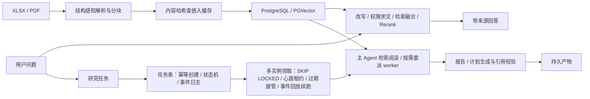

# Java 后端 + AI：企业检测资料的知识问答与研究任务平台

基于 [Ragent 1.1.0](https://github.com/nageoffer/ragent) 改造。面向企业检测资料的知识问答与研究任务：一次提问走检索问答，一个研究任务则由 Agent 反复检索、阅读、成文，耗时分钟级。后端围绕五个生产问题展开——模型调用成本、长任务可靠性、上游容错、资料权限、数据更新。**项目是预研原型，未上线，没有真实流量。**

上游 Ragent 自带 Spring Boot 骨架、SSE 通道、模型适配层、基础的文档摄取与问答链路。本仓库新增的是研究任务模块（任务表与状态机、事件流、Agent 运行时、产物落库）以及 W1—W7 的可靠性与成本改造，当前分支 `feat/llm-backend-hardening`。改动过程、根因与实验条件见[改动索引](docs/iron-ore-rag/changes/README.md)。

## 核心链路



RAG 只提供证据和候选结果，任务状态、事件与产物由后端持久化；LLM 不直接执行外部控制。

## 工程能力

| 方向 | 问题 → 做法 | 详情 |
| --- | --- | --- |
| 长任务可靠性（W2 + W7） | 发版或宕机时分钟级任务整批丢失、实例启停还会误杀其他实例的任务 → 用 PostgreSQL 当任务队列，`FOR UPDATE SKIP LOCKED` 领取、短租约 + 心跳续租、过期租约被其他实例接管、epoch 写保护拒绝旧执行者的迟到写入、由持久事件日志重建上下文续跑、停机在步边界移交；X6 另测多实例排空积压的容量与瓶颈 | [持久化执行](docs/iron-ore-rag/changes/2026-09-18-durable-research-execution.md) |
| 模型调用成本（W1 + W6） | 调用台账显示多轮调用的提示缓存几乎全部失效 → 定位到每轮改写首条系统消息破坏缓存前缀，改为稳定前缀 + 提醒移到末尾 + 只追加历史与确定性序列化 + 阈值压缩 + 显式缓存断点；W6 在 400 道未见过的题上做答案质量护栏 | [提示缓存](docs/iron-ore-rag/changes/2026-09-18-prompt-cache-stable-prefix.md) |
| 上游容错（W3） | 第三方模型与 Embedding 超时、限流时三层超时同为 30 s、失败被吞成空结果 → 分层截止时间、带抖动的有限重试、失败与无命中分离、取消传播到 HTTP、候选模型熔断回退；自建 OpenAI 兼容的模拟上游做故障注入基准 | [故障注入基准](docs/iron-ore-rag/changes/2026-09-18-upstream-fault-injection.md) |
| 资料权限（W4） | 企业资料无隔离 → 知识库可见性三档与授权，唯一判定入口在**召回之前**裁剪检索范围，研究任务创建与每次领取都校验，越权矩阵集成测试 | [权限隔离](docs/iron-ore-rag/changes/2026-09-18-knowledge-base-access-control.md) |
| 数据更新（W5） | 文档改一行要把整份资料重新向量化 → 按（模型、维度、向量文本 SHA-256）查嵌入缓存，只把变化的块送上游；块表与 pgvector 的先删后插在同一事务 | [embedding 复用](docs/iron-ore-rag/changes/2026-09-18-content-addressed-embedding-reuse.md) |
| 文档工程（早期） | 合并单元格膨胀、重复续行、跨表回并 → XLSX 精确单元格来源、结构感知分块、稳定文档键与显式版本 | 见下表 |
| 检索纯度（早期） | 全局 TopK 稀释上下文 → 请求级 TopK、`should_split` 执行、结构化重排与来源约束 | 见下表 |
| 取消竞态（早期） | 用户取消生成时 Redis 标记、进程内任务、SSE 连接与数据库 trace 并发收尾互相打架，根 run 永久悬挂 → 多入口补偿 + `RUNNING → 终态` 条件更新 | 改动索引 |
| 工程配套 | 项目独立的 PostgreSQL/PGVector、Redis、RustFS、RocketMQ Compose 开发栈；固定数据集、脚本化模型的协议测试、连真实 PostgreSQL 的集成测试与可重复评测 | [改动索引](docs/iron-ore-rag/changes/README.md) |

## 代表性结果

每行都带条件。W2、W3、W7 的数字基于自建模拟上游，不是真实供应商。

| 改动 | 条件 | 可复核结果 |
| --- | --- | --- |
| W2 跨实例接管 | 模拟上游；独立 JVM 共享运行库；租约 6 s / 轮询 1 s；每场景重复 20 次 | 恢复时间 P50 / P95 / 最大：`kill -9` 5.13 / 6.12 / 6.12 s，`SIGSTOP` 5.12 / 6.12 / 6.12 s，`SIGTERM` 1.08 / 1.11 / 1.11 s；每个被接管任务重复 1 次模型调用（在途那次，118/118）；不变量 0 失败 |
| W7 多实例容量 | 模拟上游；300 个积压任务 × 1/2/3 实例，每实例 2 槽位；轮询 5 s 重复 3 次 + 轮询 1 s 各 1 次，共 3600 任务 | 吞吐 12.2 / 24.0 / 35.8 条每分钟，加速比 1.00 / 1.98 / 2.95（轮询 1 s 为 13.3 / 26.5 / 39.7，2.98），是槽位上限的 85%—95%；等待 P50 242 s / P95 470 s（3 实例）；提交被拒 0、不变量 0 失败；领取语句均值 4.1—5.6 ms、最大 85 ms，占排空时长不到 0.12% |
| W1 提示缓存 | 真实上游；同 40 题 B、C 模式，全 Flash；每臂各一次 | 命中率 B `9.8% → 78.4%`、C `0.2% → 80.0%`；单任务计费输入 `−69%` / `−75%` |
| W6 质量护栏 | 真实上游；MuSiQue C 模式，400 道未见过的题（可答 196），前后 4 块交错 | 命中率 `0.15% → 80.4%`、单任务计费输入 `77,113 → 21,436`（−72%）；配对答案 F1 `−0.034`，95% 区间 `[−0.080, +0.011]`，未见显著下降；EM `0.352 → 0.291`；同题重跑后臂的噪声 `+0.059` |
| W3 上游故障注入 | 模拟上游；50 任务 × 4 个种子 = 每格 200 任务；embedding 无响应 10/30/50% | 成功率 `87.5 / 57.5 / 36.0%` → `100 / 98.5 / 86.0%`，Wilson 95% 区间两版不重叠（50% 档 `[29.7, 42.9] → [80.5, 90.1]`）；错误完成 1600 任务中为 0 |
| W4 权限隔离 | JUnit + 真实 PostgreSQL/pgvector | 越权矩阵 299 项全部符合（173 允许、126 拒绝，拒绝时业务服务未被调用）；私有库放最佳匹配时，其他用户 TopK=1 仍得到公开库的块（召回前过滤） |
| W5 embedding 复用 | 调研表 V1.2/V1.3 各 79 块；真实上游 SiliconFlow 单次运行 | 原样重新入库、回退旧版的上游调用 0；V1.2→V1.3 重嵌入 2/79 块，计费 token `45,722 → 1,368`（2.99%） |

### 领域适配（早期）

下表是旧工业资料回归的解析与检索结果，与上表不是同一批实验，不能混为工业场景准确率。

| 改动 | 可复核结果 | 结论 |
| --- | --- | --- |
| XLSX 结构感知分块 | 超过 1,024 字符的块 `70 → 0`；最大长度 `12,489 → 1,019`；重复块 `17 → 0` | 修复合并单元格膨胀、重复续行和跨表回并 |
| 请求级检索纯度（冻结旧索引、只替换检索代码的 D0 对照） | 平均上下文 `13.05 → 6.52`；Context Precision `17.1% → 29.2%`；文档召回保持 `97.6%` | 纯度提高，但 Anchor Recall `86.5% → 84.1%`、Hit@5 `95.2% → 90.5%` |
| 公平回填（固定回放 D2） | 机制补满空位，但 Hit@5、Context Precision 和路由纯度未通过质量门槛 | 保留在特性开关后，默认关闭 |

24 条完整回答在基线版本（B0）与检索改动前当前版（C-final）的人工严格通过率均为 `79.2%`。因此项目只声明分块质量、检索行为和工程可审计性改善，不宣称生成准确率提升。

## 能力边界

- **未上线、没有真实流量**：所有数字来自本地实验，负载由固定题集和脚本化任务构造。
- **W2、W3、W7 的数字基于自建模拟上游**：它的延迟固定、故障可控，测的是队列、执行器与容错逻辑，不是供应商的真实行为；真实上游的天花板是对方的限流。
- **租约发现不了“活着但卡住”**：只能发现进程死亡或暂停。X2 的 20 次重复里有 1 次执行者在注入故障之前就静止，原因未查明。
- **SIGTERM 仍重复 1 次模型调用**：上游 SDK 的 JVM 关闭钩子先在“模型已决定、工具未执行”处中断，该决定没有落库，接手方只能再调用一次。消除需持久化 tool_call 决定，未做。
- **W6 不能排除 0.08 以内的 F1 下降**：区间含 0，但合并早期引出疑问的 45 题后为 `−0.045 [−0.088, −0.002]`；同题重跑的运行间噪声与效应同量级。
- **W5 的复用率取决于块边界是否稳定**：表格按行累加分组，在表中插入一行会使该表后续块全部失效；ES / LightRAG / Milvus 的先删后插不在事务内。
- 图谱检索只能在结果侧过滤，不是召回前过滤；越权矩阵在 Java 层驱动 Controller，不经过 HTTP 与 Sa-Token 拦截器。
- 原始企业表格、国标原文件、模型密钥、评测响应和数据库 dump 均位于 Git 忽略目录；仓库只跟踪有限脱敏派生样本和已有公开授权的内容。

## 快速开始

需要 JDK 17、Node.js、Docker / Docker Compose。模型、Embedding、Rerank 和文档解析服务凭据通过系统环境变量、密钥管理器或 IDE Password Safe 注入，不要写入仓库或 IDE 工程文件。

```bash
docker compose -f resources/docker/dev/ragent-dev.compose.yaml up -d
docker compose -f resources/docker/dev/ragent-dev.compose.yaml ps
```

在 IDE 中运行后端入口 `bootstrap/src/main/java/com/nageoffer/ai/ragent/RagentApplication.java`，再启动前端：

```bash
cd frontend
npm ci
npm run dev
```

访问 `http://127.0.0.1:5173`。聊天入口仍为 `/chat`，在输入区选择普通问答、深入分析或生成计划，并选择知识库。研究 SSE 只读订阅，刷新按事件序号续传、不新增模型执行；主动停止才取消。已有环境按[数据库说明](resources/database/README.md)手工应用 `resources/database/upgrades/` 下的增量脚本；新环境使用当前全量 schema。

回归：`bash scripts/validate-agentic-research-p7.sh`（Python 53/53、Java 13 + 211，约 40 s），另有 `scripts/validate-agentic-research-p2-database.sh` 做结构校验。

## 文档入口

- [改动索引](docs/iron-ore-rag/changes/README.md)
- [研究长任务的持久化执行（W2，含 W7 容量）](docs/iron-ore-rag/changes/2026-09-18-durable-research-execution.md)
- [研究 Agent 的提示缓存（W1，含 W6 质量护栏）](docs/iron-ore-rag/changes/2026-09-18-prompt-cache-stable-prefix.md)
- [不稳定上游的治理与故障注入基准（W3）](docs/iron-ore-rag/changes/2026-09-18-upstream-fault-injection.md)
- [企业资料的权限隔离（W4）](docs/iron-ore-rag/changes/2026-09-18-knowledge-base-access-control.md)
- [内容寻址的 embedding 复用（W5）](docs/iron-ore-rag/changes/2026-09-18-content-addressed-embedding-reuse.md)
- 实验汇总 manifest：[W6 质量护栏](eval/agentic-research/manifests/career-w6-2026-09-19.json)、[X6 容量基准](eval/agentic-research/manifests/career-x6-2026-09-19.json)

本仓库基于 `nageoffer/ragent` 的 `1.1.0` 和提交 `f64de341452c8998ebf64cd264e60ccad6a31631` 开展改造，上游历史保持不变，并继续遵循 [Apache License 2.0](LICENSE)。
