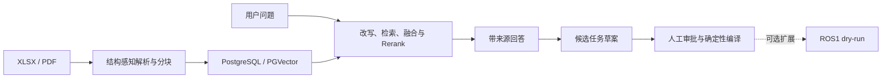

# Java 后端 + AI 工业文档 RAG

这是一个基于 [Ragent 1.1.0](https://github.com/nageoffer/ragent) 改造的工业文档 RAG 项目，面向 Java 后端 + AI 应用岗位展示完整工程能力：文档摄取、结构化分块、向量检索与重排、可追溯回答、关系数据建模、人工审批和可重复评测。

> 项目主线是工业文档知识服务。ROS1 机器人任务仅作为“已批准任务如何接入外部执行器”的可选 dry-run 扩展，不是项目定位，也不连接真实设备。

## 核心链路



RAG 只提供证据和候选草案；文档版本、来源、审批状态与执行记录由后端持久化；外部执行必须经过人工审批和白名单编译，LLM 不能直接生成底层控制指令。

## 工程重点

| 方向 | 已完成内容 | 详情 |
| --- | --- | --- |
| Java 后端 | Spring Boot 3.5.7、MyBatis-Plus、SSE、任务状态流转、版本差异与可审计 API | [工业知识闭环](docs/iron-ore-rag/changes/2026-08-12-industrial-knowledge-demo.md) |
| AI / RAG | 可替换的 Chat、Embedding、Rerank 客户端，问题改写、请求级 TopK、结构化重排与来源约束 | [请求级检索纯度](docs/iron-ore-rag/changes/2026-08-13-request-level-retrieval-purity.md) |
| 文档工程 | XLSX 精确单元格来源、结构感知分块、PDF/MinerU 接入与不可变文档版本 | [XLSX 分块](docs/iron-ore-rag/changes/2026-08-13-xlsx-structure-aware-chunking.md) |
| 数据与环境 | PostgreSQL/PGVector、Redis、RustFS、RocketMQ 的项目独立 Compose 开发栈 | [本地基线复现](docs/iron-ore-rag/stages/00-reproduction.md) |
| 评测与回归 | 固定 3 类文档、24 题、15 个解析锚点，支持盲评、数据库快照与确定性检索回放 | [小型系统评测](docs/iron-ore-rag/changes/2026-08-13-system-evaluation-harness.md) |
| 可选执行扩展 | 已批准任务可编译为 ROS1 Action dry-run，支持反馈、取消并拒绝非 dry-run 请求 | [ROS1 dry-run](docs/iron-ore-rag/changes/2026-08-12-ros1-robot-mission-demo.md) |

## 可信结果

### XLSX 结构感知分块

同一工作簿在冻结索引与 D1 干净重建中的结果如下；完整条件与回滚方式见 [XLSX 分块记录](docs/iron-ore-rag/changes/2026-08-13-xlsx-structure-aware-chunking.md)。

| 指标 | 修复前 | 修复后 |
| --- | ---: | ---: |
| 分块数量 | 123 | 79 |
| 平均正文字符数 | 1,573.2 | 843.5 |
| 最大正文字符数 | 12,489 | 1,019 |
| 超过 1,024 字符的块 | 70 | 0 |
| 多余精确重复块 | 17 | 0 |
| 固定解析锚点 | 5/5 | 5/5 |

### 请求级检索纯度

D0 复用 C-final 的 141 个冻结块，只替换检索代码，以隔离请求级预算、问题拆分和结构化 Rerank 的影响；详情见 [请求级检索记录](docs/iron-ore-rag/changes/2026-08-13-request-level-retrieval-purity.md)。

| 指标 | C-final | D0 |
| --- | ---: | ---: |
| 平均返回块数 | 13.05 | 6.52 |
| 最大返回块数 | 19 | 10 |
| 超过请求级 TopK=10 的题数 | 17/21 | 0/21 |
| Context Precision | 17.1% | 29.2% |
| 路由纯度 | 73.6% | 84.8% |
| 文档召回 | 97.6% | 97.6% |

### D2 公平回填：门槛未通过

D2 固定相同的改写结果，对默认路径（off）和公平回填候选（on）各重复 3 次。下表是六轮结果的组内中位数，完整协议与逐轮结果见 [D2 固定回放评测](docs/iron-ore-rag/changes/2026-08-14-request-level-fair-refill.md)。

| 指标（中位数） | off | on |
| --- | ---: | ---: |
| `anchor_hit@5_any` | 0.905 | 0.762 |
| `anchor_recall` | 0.841 | 0.865 |
| `context_precision` | 0.254 | 0.200 |
| `doc_recall` | 1.000 | 1.000 |
| `routing_purity` | 0.915 | 0.811 |
| P95 延迟 | 6,542 ms | 9,584 ms |

公平回填在每次 24 题回放中都补满了旧路径存在空位的 19 题；`anchor_recall` 改善、`doc_recall` 持平，但 Hit@5、Context Precision 和路由纯度退化，P95 延迟也变差（仅记录、不参与放行）。质量 gate 失败，功能保留在特性开关后，默认配置继续使用 `rag.search.request-level-refill-enabled=false`。

24 条完整回答的人工严格通过率在 B0 与 C-final 中均为 79.2%，因此这里只声明分块质量、检索行为和工程可审计性，不宣称生成准确率提升。

## 能力边界

- 评测集只有 3 份文档和 24 条固定问题，适合定位回归，不代表通用 Office 解析或工业领域基准。
- 默认评测配置为 `intent=off, ocr=off`；源码中存在的其他通道不等于运行态已经启用。
- MinerU 在线解析存在运行间漂移，重新入库后的 PDF 指标不能简单归因于本地代码。
- 当前不具备真实实验设备、感知定位、底层控制或机器人安全联锁；ROS1 只验证纸箱搬运 dry-run。

## 快速开始

环境需要 JDK 17、Node.js、Docker / Docker Compose，以及通过系统环境变量、密钥管理器或 IDE Password Safe 注入的模型、Embedding、Rerank 和文档解析服务凭据。密钥不要写入仓库或 IDE 工程文件。

启动项目独立中间件：

```bash
docker compose -f resources/docker/dev/ragent-dev.compose.yaml up -d
docker compose -f resources/docker/dev/ragent-dev.compose.yaml ps
```

在 IDE 中运行后端入口：

```text
bootstrap/src/main/java/com/nageoffer/ai/ragent/RagentApplication.java
```

再启动前端：

```bash
cd frontend
npm ci
npm run dev
```

访问 `http://127.0.0.1:5173`。端口、冒烟步骤和清理边界见 [阶段 0 复现说明](docs/iron-ore-rag/stages/00-reproduction.md)。

## 代码与文档入口

| 路径 | 用途 |
| --- | --- |
| `bootstrap/` | RAG、知识库、摄取、审批、任务和管理 API |
| `infra-ai/` | Chat、Embedding、Rerank、VLM 与模型路由 |
| `framework/` | Web、认证上下文、Redis、MQ 与 Trace 基础能力 |
| `eval/iron-ore/` | 固定题集、检索/回答评测、盲评和快照工具 |
| `frontend/` | 聊天、来源预览、知识库与任务审批页面 |
| `robot-gateway/` | 可选的 ROS1 Action dry-run 适配层 |

- [当前检查点与阅读路径](docs/iron-ore-rag/README.md)
- [改动索引](docs/iron-ore-rag/changes/README.md)
- [评测说明](eval/iron-ore/README.md)与[固定运行手册](eval/iron-ore/RUNBOOK.md)

原始企业材料、模型密钥、评测响应和数据库 dump 位于 Git 忽略目录，不随仓库发布。

## 上游与许可证

本仓库基于 `nageoffer/ragent` 的 `1.1.0` 版本和提交 `f64de341452c8998ebf64cd264e60ccad6a31631` 开展改造，上游作者及历史提交保持不变。项目继续遵循 [Apache License 2.0](LICENSE)。
