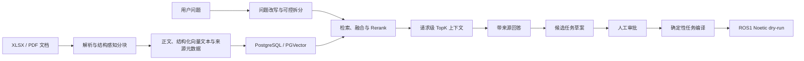

# 铁矿检测流程 RAG 与 ROS1 Dry-run

基于 [Ragent 1.1.0](https://github.com/nageoffer/ragent) 改造的工业文档 RAG 项目，面向铁矿检测流程中的文档解析、证据检索、候选任务审批和受控机器人任务演示。

本仓库重点不是包装通用聊天 Demo，而是建立一条可审计的最小闭环：文档中的事实必须能够追溯到来源，模型生成的任务只能作为候选草案，批准后的任务由确定性代码编译，并且当前机器人接口只允许 ROS1 dry-run。

> 当前能力边界：不连接真实机器人，不执行真实矿石检测，不让 LLM 直接生成底层控制指令，也不把 3 份文档的小型评测外推为行业基准。

## 项目流程



知识、审批、编排与控制被刻意分开：RAG 提供证据和草案，关系数据库保存版本与审批状态，白名单编译器生成任务，ROS1 网关只接受明确允许的模拟技能。

## 主要改动

| 方向 | 已完成内容 | 详细记录 |
| --- | --- | --- |
| 可重复开发环境 | 使用独立 PostgreSQL/PGVector、Redis、RustFS 和 RocketMQ Compose 栈，隔离研究数据与上游环境 | [阶段 0：本地基线复现](docs/iron-ore-rag/stages/00-reproduction.md) |
| 工业知识闭环 | XLSX 精确来源、严格检索、候选任务、人工批准、模拟执行和确定性版本差异 | [工业知识闭环 Demo](docs/iron-ore-rag/changes/2026-08-12-industrial-knowledge-demo.md) |
| ROS1 受控执行 | 将已批准任务编译为白名单搬运技能，支持 Action 派发、反馈、取消，并拒绝非 dry-run 请求 | [ROS1 机器人任务 Demo](docs/iron-ore-rag/changes/2026-08-12-ros1-robot-mission-demo.md) |
| 可审计评测 | 固定 3 类文档、24 条问题、15 个解析锚点、基线/当前版隔离数据库、盲评与快照恢复工具 | [小型系统评测](docs/iron-ore-rag/changes/2026-08-13-system-evaluation-harness.md) |
| XLSX 分块 | 修复合并单元格膨胀、重复续行、Markdown/Embedding 双预算失真和跨工作表回并 | [XLSX 结构感知分块](docs/iron-ore-rag/changes/2026-08-13-xlsx-structure-aware-chunking.md) |
| 检索纯度 | 恢复请求级 TopK 契约，执行 `should_split`，让文档名和结构化向量文本参与 Rerank | [请求级检索纯度](docs/iron-ore-rag/changes/2026-08-13-request-level-retrieval-purity.md) |

完整提交和回滚入口见[改动索引](docs/iron-ore-rag/changes/README.md)。

## 量化结果

### XLSX 分块

同一份铁矿检测流程工作簿在冻结索引与修复后 D1 干净重建中的结果：

| 指标 | 修复前 | 修复后 |
| --- | ---: | ---: |
| 分块数量 | 123 | 79 |
| 平均正文字符数 | 1,573.2 | 843.5 |
| 最大正文字符数 | 12,489 | 1,019 |
| 超过 1,024 字符的块 | 70 | 0 |
| 多余精确重复块 | 17 | 0 |
| 固定解析锚点 | 5/5 | 5/5 |

### 检索纯度

D0 直接复用 C-final 的 141 个冻结块，只替换检索代码，用于隔离请求级预算、问题拆分和结构化 Rerank 的影响：

| 指标 | C-final | D0 |
| --- | ---: | ---: |
| 平均返回块数 | 13.05 | 6.52 |
| 最大返回块数 | 19 | 10 |
| 超过请求级 TopK=10 的题数 | 17/21 | 0/21 |
| Context Precision | 17.1% | 29.2% |
| 路由纯度 | 73.6% | 84.8% |
| 文档召回 | 97.6% | 97.6% |

这些数字描述的是固定小样本中的分块与检索，不是完整回答准确率。24 条完整回答的人工严格通过率在基线与 C-final 中均为 79.2%，因此本项目不会把本轮结果表述为生成质量提升。

## 已知限制与下一步

- 评测集只有 3 份文档和 24 条固定问题，适合定位回归，不代表通用 Excel/PDF 或工业领域水平。
- D0 的自动 Anchor Recall 从 86.5% 变为 84.1%，Hit@5(any) 从 95.2% 变为 90.5%。新增失败题已返回正确标准标题，但没有命中严格字符串锚点；原始分数仍保留，没有事后修改题集。
- 多子问题分别截断后再去重时，剩余请求额度还不会从候选池公平补位；D1 因此漏掉一条仍存在于正确 sheet 的称样量块。
- MinerU 在线解析存在运行间漂移；重新入库后的 PDF 总体指标不能简单归因于本地代码。
- 当前 ROS1 集成只验证纸箱搬运 dry-run。真实设备、安全联锁、感知定位和底层控制不属于本检查点。
- 阶段 2/3 的自动化验证已完成，但登录页面中的最终人工点击验收仍是单独待办。

如果继续优化，优先固定问题改写输出、实现请求级去重后的公平补位，并进行至少三次重复运行；不通过简单增加 TopK 追逐一次有利数字。

## 技术栈

- 后端：Java 17、Spring Boot 3.5.7、MyBatis-Plus、SSE
- AI 链路：自定义 Chat / Embedding / Rerank 客户端、问题改写、意图树、多通道检索框架
- 数据与中间件：PostgreSQL、PGVector、Redis/Redisson、RocketMQ、RustFS
- 文档处理：Apache Tika、POI、MinerU，结构化 XLSX/PDF 分块与来源元数据
- 前端：React 18、TypeScript、Vite、Zustand、Radix UI
- 机器人演示：ROS1 Noetic Action、Python dry-run 网关

默认评测配置只启用向量召回与 Rerank。源码虽然保留关键词、图检索和联网搜索通道，但不能据此宣称运行态已经启用全部混合检索能力。

## 快速开始

### 1. 环境要求

- JDK 17
- Node.js 与 npm
- Docker 与 Docker Compose
- 与本地配置相匹配的模型、Embedding、Rerank 和文档解析服务凭据

密钥只应放在系统环境变量或 IDE Run Configuration 中，不要写入仓库。

### 2. 启动中间件

```bash
docker compose -f resources/docker/dev/ragent-dev.compose.yaml up -d
docker compose -f resources/docker/dev/ragent-dev.compose.yaml ps
```

该开发栈会启动 PostgreSQL/PGVector、Redis、RustFS 和 RocketMQ。端口和数据重建边界见[本地中间件说明](resources/docker/dev/README.md)。

### 3. 启动后端与前端

在 IDE 中运行：

```text
bootstrap/src/main/java/com/nageoffer/ai/ragent/RagentApplication.java
```

随后启动前端：

```bash
cd frontend
npm ci
npm run dev
```

访问 `http://127.0.0.1:5173`。完整冒烟步骤、默认端口和清理注意事项见[阶段 0 复现说明](docs/iron-ore-rag/stages/00-reproduction.md)。

## 仓库结构

| 路径 | 用途 |
| --- | --- |
| `bootstrap/` | RAG、知识库、摄取、审批、任务和管理 API |
| `framework/` | Web、认证上下文、Redis、MQ、Trace 等基础能力 |
| `infra-ai/` | Chat、Embedding、Rerank、VLM 与模型路由 |
| `frontend/` | 聊天、来源预览、知识库、任务审批与机器人演示页面 |
| `robot-gateway/` | ROS1 Action、dry-run 网关和机器人演示消息 |
| `eval/iron-ore/` | 固定题集校验、检索/回答评测、盲评和快照工具 |
| `docs/iron-ore-rag/` | 当前检查点、阶段说明、改动详情和历史归档 |

原始企业材料、模型密钥、评测响应和数据库 dump 位于 Git 忽略目录，不随仓库发布。

## 文档入口

- [当前检查点与阅读路径](docs/iron-ore-rag/README.md)
- [全部改动索引](docs/iron-ore-rag/changes/README.md)
- [评测方法](eval/iron-ore/README.md)与[固定运行手册](eval/iron-ore/RUNBOOK.md)
- [阶段 2：工业知识闭环验收](docs/iron-ore-rag/stages/02-industrial-knowledge-demo.md)
- [阶段 3：ROS1 dry-run 验收](docs/iron-ore-rag/stages/03-ros1-robot-mission-demo.md)

## 上游与许可证

本仓库基于 `nageoffer/ragent` 的 `1.1.0` 版本和提交 `f64de341452c8998ebf64cd264e60ccad6a31631` 开展改造。上游作者及历史提交保持不变；本 fork 的领域改动、评测和实验结论由本仓库单独记录。

项目继续遵循 [Apache License 2.0](LICENSE)。
