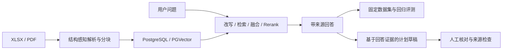

# Java 后端 + AI 工业文档 RAG

基于 [Ragent 1.1.0](https://github.com/nageoffer/ragent) 的工业文档知识服务。项目复用上游 Spring Boot、SSE、模型适配和基础摄取能力，在此之上新增稳定版本元数据、XLSX 结构化分块、请求级检索、带证据的计划草稿和可重复评测，展示 Java 后端 + AI 的工程主链路。

当前在 `feat/agentic-research` 按[统一研究工作流计划](docs/iron-ore-rag/agentic-research-implementation-plan-2026-09-17.md)逐步改造。P1 退役送检、模拟执行和 ROS1 演示；新研究 Agent、深入分析与多文档计划入口将在后续阶段接入，实际进度见[执行记录](docs/iron-ore-rag/agentic-research-execution-log.md)。

## 核心链路



RAG 只提供证据和候选结果，文档版本、来源与状态由后端持久化；LLM 不直接执行外部控制。

## 工程能力

| 方向 | 已完成内容 | 详情 |
| --- | --- | --- |
| Java 后端 | 复用上游 Spring Boot 3.5.7、MyBatis-Plus 和 SSE；新增计划草稿持久化、确定性版本差异与可审计 API | [工业知识闭环历史记录](docs/iron-ore-rag/changes/2026-08-12-industrial-knowledge-demo.md) |
| 后端可靠性 | 修复用户取消生成时 Redis 标记、进程内任务、SSE 连接与数据库 trace 并发收尾的竞态；通过多入口补偿和 `RUNNING → 终态` 条件更新，避免根 run 永久悬挂 | [取消后 trace 收尾](docs/iron-ore-rag/changes/2026-08-12-cancel-trace-run-hang.md) |
| AI / RAG | 复用可替换模型客户端；新增请求级 TopK、`should_split` 执行、结构化重排和来源约束 | [检索纯度改进](docs/iron-ore-rag/changes/2026-08-13-request-level-retrieval-purity.md) |
| 研究改造 | 本轮建立实施基线并退役送检与执行演示；保留过渡期的单文档计划草稿，新研究运行器尚未接入 | [执行进度与接续点](docs/iron-ore-rag/agentic-research-execution-log.md) |
| 文档工程 | 复用 POI 与 PDF/MinerU 接入；新增 XLSX 精确单元格来源、结构感知分块、稳定文档键和显式版本 | [XLSX 分块](docs/iron-ore-rag/changes/2026-08-13-xlsx-structure-aware-chunking.md) |
| 数据环境 | 为 PostgreSQL/PGVector、Redis、RustFS、RocketMQ 建立项目独立 Compose 开发栈 | [本地开发栈](docs/iron-ore-rag/changes/2026-08-12-reproducible-local-development-stack.md) |
| 评测回归 | 新增固定 3 类文档、24 题、15 个解析锚点，支持盲评、快照及固定改写和哈希校验的配对回放 | [评测工具](docs/iron-ore-rag/changes/2026-08-13-system-evaluation-harness.md) |

## 代表性结果

| 改动 | 可复核结果 | 结论 |
| --- | --- | --- |
| XLSX 结构感知分块 | 超过 1,024 字符的块 `70 → 0`；最大长度 `12,489 → 1,019`；重复块 `17 → 0` | 修复合并单元格膨胀、重复续行和跨表回并 |
| 请求级检索纯度（冻结旧索引、只替换检索代码的 D0 对照） | 平均上下文 `13.05 → 6.52`；Context Precision `17.1% → 29.2%`；文档召回保持 `97.6%` | 纯度提高，但 Anchor Recall `86.5% → 84.1%`、Hit@5 `95.2% → 90.5%` |
| 公平回填（固定回放 D2） | 机制补满空位，但 Hit@5、Context Precision 和路由纯度未通过质量门槛 | 保留在特性开关后，默认关闭 |

24 条完整回答在基线版本（B0）与检索改动前当前版（C-final）的人工严格通过率均为 `79.2%`。因此项目只声明分块质量、检索行为和工程可审计性改善，不宣称生成准确率提升。实验条件与完整指标见[改动索引](docs/iron-ore-rag/changes/README.md)。

## 能力边界

- 评测集只有 3 份文档和 24 条固定问题，适合定位回归，不是通用 Office 解析或工业领域基准。
- 最终评测配置为 `intent=off, ocr=off`，公平回填保持 `rag.search.request-level-refill-enabled=false`。
- D0 是冻结旧索引、只替换检索代码的对照；D1 是重新入库后的组合验证，期间 PDF/MinerU 结果发生漂移，不能把全部变化归因于本地代码。
- 当前保留的草稿入口使用单条回答保存的单文档检索片段，尚无主动补查、多文档研究或新研究模型调用；本轮验证范围见[验证报告](docs/iron-ore-rag/agentic-research-validation-report.md)。
- 送检、模拟和 ROS1 的旧实现已退役；对应变更说明与历史测试保留，不用于证明新研究工作流的能力。
- 原始企业表格、国标原文件、模型密钥、评测响应和数据库 dump 均位于 Git 忽略目录，不进入公开仓库；仓库只跟踪有限脱敏派生样本和已有公开授权的内容。

## 快速开始

需要 JDK 17、Node.js、Docker / Docker Compose。模型、Embedding、Rerank 和文档解析服务凭据通过系统环境变量、密钥管理器或 IDE Password Safe 注入，不要写入仓库或 IDE 工程文件。

```bash
docker compose -f resources/docker/dev/ragent-dev.compose.yaml up -d
docker compose -f resources/docker/dev/ragent-dev.compose.yaml ps
```

在 IDE 中运行后端入口：

```text
bootstrap/src/main/java/com/nageoffer/ai/ragent/RagentApplication.java
```

再启动前端：

```bash
cd frontend
npm ci
npm run dev
```

访问 `http://127.0.0.1:5173`。端口、冒烟步骤与清理边界见[本地基线复现](docs/iron-ore-rag/stages/00-reproduction.md)。

普通问答入口仍为 `/chat`；带 XLSX 来源的回答可整理为计划草稿并核对证据。已有环境的旧模拟意图需按[数据库退役说明](resources/database/README.md#2026-09-17旧执行演示退役)停用并清除意图缓存；新环境直接使用当前全量 schema。深入分析与统一计划入口的接入安排见实施计划。

## 文档入口

- [研究改造实施记录](docs/iron-ore-rag/agentic-research-execution-log.md)与[实际验证范围](docs/iron-ore-rag/agentic-research-validation-report.md)
- [项目复习主讲义：上游特色、完整流程与证据约束闭环](docs/iron-ore-rag/project-study-guide.md)
- [当前检查点与阅读路径](docs/iron-ore-rag/README.md)
- [改动索引](docs/iron-ore-rag/changes/README.md)
- [评测说明](eval/iron-ore/README.md)与[固定运行手册](eval/iron-ore/RUNBOOK.md)

本仓库基于 `nageoffer/ragent` 的 `1.1.0` 和提交 `f64de341452c8998ebf64cd264e60ccad6a31631` 开展改造，上游历史保持不变，并继续遵循 [Apache License 2.0](LICENSE)。
