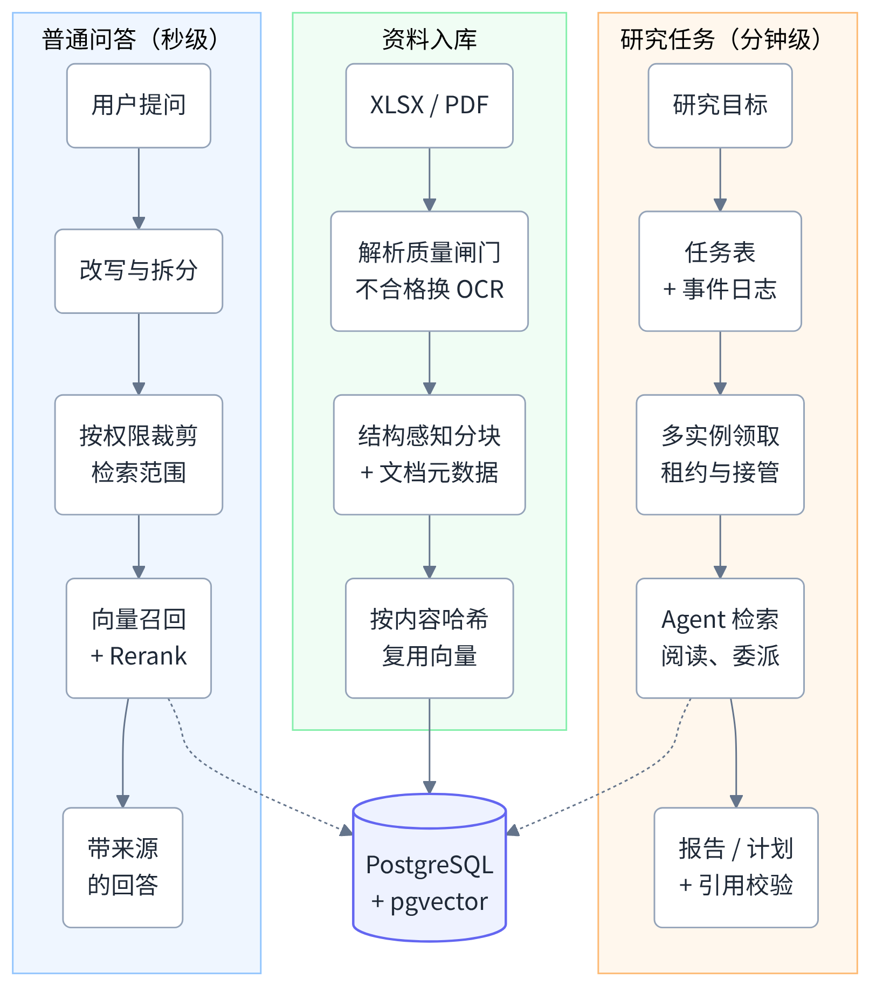
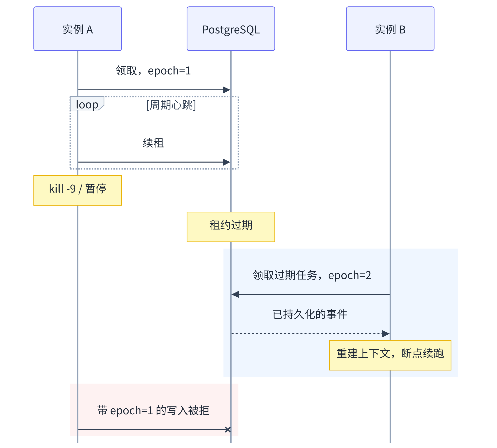

<div align="center">

# 企业检测资料知识问答与研究任务平台

Java 后端 + AI · 基于 [Ragent 1.1.0](https://github.com/nageoffer/ragent) 改造


</div>

> [!NOTE]
> **预研原型，未上线，没有真实流量。** 文中数字都来自本地实验，并注明实验条件：长任务接管、上游容错、多实例容量三项基于自建的模拟上游；提示缓存、答案质量、embedding 复用三项调用了真实的模型供应商。

## 项目简介

面向检测机构积累的调研表、国标条文和检测报告，提供两种用法：

- **普通问答**：一次提问走检索问答，几秒内给出带来源的回答。
- **研究任务**：Agent 反复检索、阅读、成文，一次运行几分钟、十几次模型调用，产出带引用的报告或计划。

后端围绕五个生产问题展开：**长任务可靠性、模型调用成本、上游容错、资料权限、数据更新**。

| 来源 | 内容 |
| --- | --- |
| 上游 Ragent 自带 | Spring Boot 骨架、SSE 通道、多供应商模型适配，以及解析、分块、向量化、检索、重排的基础问答链路 |
| 本仓库新增 | 研究任务模块（任务表与状态机、事件流、Agent 运行时、产物落库）；五个生产问题的改造与验证实验；表格资料分块等早期领域适配 |

## 系统总览

<p align="center">
  
</p>

RAG 只提供证据和候选结果；任务状态、事件与产物由后端持久化，LLM 不直接执行外部控制。

## 五个生产问题

| 问题与做法 | 关键结果 |
| --- | --- |
| **[长任务可靠性](#长任务可靠性)**<br>数据库队列、心跳租约、epoch 写保护、事件回放 | 租约 6 s 时，`kill -9` 后 P95 6.12 s 被其他实例接管（模拟上游） |
| **[模型调用成本](#模型调用成本)**<br>稳定前缀、提醒后置、显式缓存断点 | 缓存命中率不足 10% → 约 80%，单任务计费输入约 −70%（真实上游） |
| **[上游容错](#上游容错)**<br>分层超时、抖动重试、失败与无命中分离 | 30% 请求无响应时，成功率 57.5% → 98.5%（模拟上游） |
| **[资料权限](#资料权限)**<br>召回之前按权限裁剪检索范围 | 越权矩阵 299 项全部符合（集成测试） |
| **[数据更新](#数据更新)**<br>按内容哈希复用向量 | 改版后只重嵌入 2/79 块（真实上游） |

### 长任务可靠性

**实例宕机、暂停或发版时，任务由其他实例接管，并从断点续跑。**

**问题**：研究任务一次要跑几分钟。原实现发版或宕机时任务整批丢失；实例启停时还会把全库运行中的任务标为中断，误杀其他实例的健康任务。

**做法**：

1. PostgreSQL 当任务队列，各实例按空闲槽位用 `FOR UPDATE SKIP LOCKED` 领取。
2. 短租约 + 心跳续租（默认租约 30 s、每 10 s 续租）；实例失联后租约过期，由其他实例接管。
3. 每次领取 epoch + 1 并发新的租约令牌，所有写入都核对二者，旧执行者恢复后的迟到写入一律被拒。
4. 接管方从持久化的事件日志重建已完成的工具往返，从断点续跑。
5. 计划停机时在步边界主动交还任务，不必等租约过期。

<p align="center">
  
</p>

**结果**（模拟上游；独立 JVM 共享运行库；租约 6 s / 轮询 1 s；每个场景重复 20 次）

| 注入的故障 | 恢复时间 P50 / P95 / 最大 |
| --- | --- |
| `kill -9` | 5.13 / 6.12 / 6.12 s |
| `SIGSTOP`（进程暂停） | 5.12 / 6.12 / 6.12 s |
| `SIGTERM`（计划停机） | 1.08 / 1.11 / 1.11 s |

- 逐任务检查的不变量 0 失败：恰好一个终态事件、至多一个产物、事件序号连续、已完成的工具调用不重复执行。
- 每个被接管的任务重复 1 次模型调用，都是崩溃时在途的那一次（118/118）。

**多实例容量**（模拟上游；300 个积压任务，每实例 2 个槽位；轮询 5 s 重复 3 次 + 轮询 1 s 各 1 次，共 3600 个任务）

| 实例数 | 1 | 2 | 3 |
| --- | --- | --- | --- |
| 吞吐（条/分钟，轮询 5 s） | 12.2 | 24.0 | 35.8 |
| 加速比 | 1.00 | 1.98 | 2.95 |

轮询 1 s 时吞吐为 13.3 / 26.5 / 39.7、加速比 2.98；吞吐是槽位上限的 85%—95%。3 实例时等待 P50 242 s、P95 470 s；提交被拒 0，不变量 0 失败；领取语句均值 4.1—5.6 ms、最大 85 ms，占排空时长不到 0.12%。**瓶颈是槽位与轮询间隔，不是数据库。**

详见 [研究长任务的持久化执行](docs/iron-ore-rag/changes/2026-09-18-durable-research-execution.md)。

### 模型调用成本

**研究 Agent 多轮调用的提示缓存，从几乎全部失效恢复到约八成命中。**

**问题**：调用台账显示，多轮调用的提示缓存几乎全部失效。定位到两个原因：每轮都把易变的提醒写进首条系统消息，破坏了缓存前缀；历史的滑动裁剪也让前缀每轮都在变。

**做法**：

| 位置 | 改造前 | 改造后 |
| --- | --- | --- |
| 系统消息 | 每轮写入预算等易变提醒 | 保持不变，作为稳定前缀 |
| 历史消息 | 滑动裁剪，前缀每轮都变 | 只追加；超过阈值才压缩 |
| 动态提醒 | 放在系统消息里 | 移到末尾，不写回历史 |
| 缓存标记 | 只有隐式缓存 | 显式缓存断点（可开关） |

历史按确定性方式序列化，压缩以完整的工具往返为单位；显式断点按供应商协议标记，关掉开关即退回隐式缓存。

**结果**（真实上游）

| 实验 | 缓存命中率 | 单任务计费输入 |
| --- | --- | --- |
| 同负载对照：单 Agent（B） | 9.8% → 78.4% | −69% |
| 同负载对照：可委派子 Agent（C） | 0.2% → 80.0% | −75% |
| 答案质量护栏：C 模式 | 0.15% → 80.4% | 77,113 → 21,436（−72%） |

- 同负载对照：同 40 题，全部角色用 qwen3.7-flash，每臂各跑一次。
- 答案质量护栏：MuSiQue 中 400 道未见过的题（可答 196），前后分 4 块交错运行。

**答案质量**：配对答案 F1 −0.034，95% 区间 [−0.080, +0.011]，未见显著下降，但不能排除 0.08 以内的下降；EM 0.352 → 0.291；同题重跑后臂的运行间噪声为 +0.059。

详见 [研究 Agent 的提示缓存](docs/iron-ore-rag/changes/2026-09-18-prompt-cache-stable-prefix.md)。

### 上游容错

**第三方模型与 Embedding 接口超时、限流时，任务不再大面积失败。**

**问题**：三层超时同为 30 s；调用失败被吞成空结果，看起来和"资料里没有"一样。

**做法**：分层截止时间；带抖动的有限重试；区分调用失败与检索无命中；取消传播到 HTTP 请求；候选模型熔断回退。为了能稳定复现故障，自建了 OpenAI 兼容的模拟上游做故障注入基准。

**结果**（模拟上游；50 任务 × 4 个种子 = 每格 200 任务）

| Embedding 无响应比例 | 10% | 30% | 50% |
| --- | --- | --- | --- |
| 治理前成功率 | 87.5% | 57.5% | 36.0% |
| 治理后成功率 | 100% | 98.5% | 86.0% |

两版的 Wilson 95% 区间不重叠（如 50% 档 [29.7, 42.9] → [80.5, 90.1]）；1600 个任务中错误完成（任务显示完成、却缺少要求的证据）为 0。

详见 [不稳定上游的治理与故障注入基准](docs/iron-ore-rag/changes/2026-09-18-upstream-fault-injection.md)。

### 资料权限

**用户无权读取的知识库，在召回之前就被排除。**

**问题**：知识库全局共享。知识库、文档、分块的接口都不校验权限，登录用户可以按 ID 读、改、删任何库；问答检索的范围就是全部有效库；停止接口也不校验任务归属。

**做法**：知识库可见性分三档并支持授权；唯一的判定入口在**召回之前**裁剪检索范围；研究任务在创建时和每次领取时都校验权限；停止接口校验任务归属。

**结果**（JUnit + 真实 PostgreSQL/pgvector）：越权矩阵 299 项全部符合（173 允许、126 拒绝，拒绝时业务服务未被调用）；把最佳匹配放进私有库，其他用户 TopK=1 拿到的仍是公开库的块，说明过滤发生在召回之前。

详见 [企业资料的权限隔离](docs/iron-ore-rag/changes/2026-09-18-knowledge-base-access-control.md)。

### 数据更新

**文档改一行，只把变化的块重新向量化。**

**问题**：文档改一行，就要把整份资料重新向量化。

**做法**：按（模型、维度、向量文本 SHA-256）查嵌入缓存，只把变化的块送上游；块表与 pgvector 的先删后插在同一事务里完成。

**结果**（调研表 V1.2 / V1.3 各 79 块；真实上游 SiliconFlow，单次运行）：原样重新入库，上游调用 0 次；V1.2 → V1.3 只重嵌入 2/79 块，计费 token 45,722 → 1,368（2.99%）。

详见 [内容寻址的 embedding 复用](docs/iron-ore-rag/changes/2026-09-18-content-addressed-embedding-reuse.md)。

## 早期工作：领域适配

- **表格资料分块**：修复合并单元格膨胀、重复续行和跨表回并；XLSX 精确到单元格的来源、结构感知分块、稳定文档键与显式版本。
- **检索纯度**：全局 TopK 会稀释上下文，改为请求级 TopK、执行 `should_split`、结构化重排与来源约束。
- **取消竞态**：用户取消生成时，Redis 标记、进程内任务、SSE 连接与数据库 trace 并发收尾互相打架，根 run 永久悬挂；改为多入口补偿 + `RUNNING → 终态` 条件更新。

下表是旧工业资料回归的解析与检索结果，与上文不是同一批实验，不能当作工业场景的准确率。

| 改动 | 可复核结果 | 结论 |
| --- | --- | --- |
| XLSX 结构感知分块 | 超过 1,024 字符的块 70 → 0；最大长度 12,489 → 1,019；重复块 17 → 0 | 修复合并单元格膨胀、重复续行和跨表回并 |
| 请求级检索纯度（冻结旧索引、只替换检索代码的 D0 对照） | 平均上下文 13.05 → 6.52；Context Precision 17.1% → 29.2%；文档召回保持 97.6% | 纯度提高，但 Anchor Recall 86.5% → 84.1%、Hit@5 95.2% → 90.5% |
| 公平回填（固定回放 D2） | 机制补满空位，但 Hit@5、Context Precision 和路由纯度未通过质量门槛 | 保留在特性开关后，默认关闭 |

24 条完整回答在基线版本（B0）与检索改动前当前版（C-final）的人工严格通过率均为 79.2%。因此项目只声明分块质量、检索行为和工程可审计性的改善，不宣称生成准确率提升。

## 技术栈

| 层 | 选型 |
| --- | --- |
| 后端 | Java 17、Spring Boot 3.5、MyBatis-Plus、Sa-Token |
| Agent 与模型 | AgentScope Java 2.0；阿里云百炼、SiliconFlow |
| 存储 | PostgreSQL 16 + pgvector、Redis、RustFS（S3 兼容对象存储） |
| 消息 | RocketMQ 5.2（文档入库的事务消息） |
| 前端 | React 18、Vite；通过 SSE 接收回答与研究进度 |
| 测试与评测 | 连真实 PostgreSQL/pgvector 的 JUnit 集成测试；Python 评测脚本；OpenAI 兼容的模拟上游 |

## 能力边界

- **未上线、没有真实流量**：所有数字来自本地实验，负载由固定题集和脚本化任务构造。
- **接管、容错、容量三项基于自建模拟上游**：延迟与故障都由脚本控制，测的是队列、执行器与容错逻辑，不是供应商的真实行为；真实上游的天花板是对方的限流。
- **租约发现不了"活着但卡住"**：只能发现进程死亡或暂停。接管实验的 20 次重复里，有 1 次执行者在注入故障之前就静止了，原因未查明。
- **SIGTERM 仍重复 1 次模型调用**：上游 SDK 的 JVM 关闭钩子先在"模型已决定、工具未执行"处中断，该决定没有落库，接手方只能再调用一次。消除需持久化 tool_call 决定，未做。
- **答案质量护栏不能排除 0.08 以内的 F1 下降**：区间含 0，但合并早期引出疑问的 45 题后为 −0.045 [−0.088, −0.002]；同题重跑的运行间噪声与效应同量级。
- **embedding 复用率取决于块边界是否稳定**：表格按行累加分组，在表中插入一行会使该表后续块全部失效。
- **越权矩阵不经过 HTTP 层**：在 Java 层驱动 Controller，没有经过 HTTP 与 Sa-Token 拦截器。
- **原始资料不入库**：原始企业表格、国标原文件、模型密钥、评测响应和数据库 dump 均位于 Git 忽略目录；仓库只跟踪有限的脱敏派生样本和已有公开授权的内容。

## 快速开始

需要 JDK 17、Node.js、Docker / Docker Compose。模型、Embedding、Rerank 和文档解析服务的凭据通过环境变量、密钥管理器或 IDE Password Safe 注入，不要写进仓库或 IDE 工程文件。

**1. 启动依赖**（PostgreSQL/pgvector、Redis、RustFS、RocketMQ）

```bash
docker compose -f resources/docker/dev/ragent-dev.compose.yaml up -d
docker compose -f resources/docker/dev/ragent-dev.compose.yaml ps
```

**2. 启动后端**：在 IDE 中运行 `bootstrap/src/main/java/com/nageoffer/ai/ragent/RagentApplication.java`。

**3. 启动前端**

```bash
cd frontend
npm ci
npm run dev
```

**4. 使用**：访问 `http://127.0.0.1:5173`，聊天入口为 `/chat`。在输入区选择普通问答、深入分析或生成计划，并选择知识库。研究进度通过只读 SSE 订阅，刷新后按事件序号续传，不会新增模型执行；只有主动停止才会取消任务。

**数据库**：新环境使用当前全量 schema；已有环境按[数据库说明](resources/database/README.md)手工应用 `resources/database/upgrades/` 下的增量脚本。

**回归**：`bash scripts/validate-agentic-research-p7.sh`（Python 53/53、Java 13 + 211，约 40 s）；`scripts/validate-agentic-research-p2-database.sh` 做结构校验。

## 文档

- [改动索引](docs/iron-ore-rag/changes/README.md)：每项改动对应的提交、原因与证据
- [研究长任务的持久化执行](docs/iron-ore-rag/changes/2026-09-18-durable-research-execution.md)（含多实例容量基准）
- [研究 Agent 的提示缓存](docs/iron-ore-rag/changes/2026-09-18-prompt-cache-stable-prefix.md)（含答案质量护栏）
- [不稳定上游的治理与故障注入基准](docs/iron-ore-rag/changes/2026-09-18-upstream-fault-injection.md)
- [企业资料的权限隔离](docs/iron-ore-rag/changes/2026-09-18-knowledge-base-access-control.md)
- [内容寻址的 embedding 复用](docs/iron-ore-rag/changes/2026-09-18-content-addressed-embedding-reuse.md)
- 实验汇总 manifest：[答案质量护栏](eval/agentic-research/manifests/career-w6-2026-09-19.json)、[多实例容量基准](eval/agentic-research/manifests/career-x6-2026-09-19.json)

## 许可

本仓库基于 [nageoffer/ragent](https://github.com/nageoffer/ragent) 的 `1.1.0`（提交 `f64de341452c8998ebf64cd264e60ccad6a31631`）改造，上游历史保持不变，继续遵循 [Apache License 2.0](LICENSE)。
