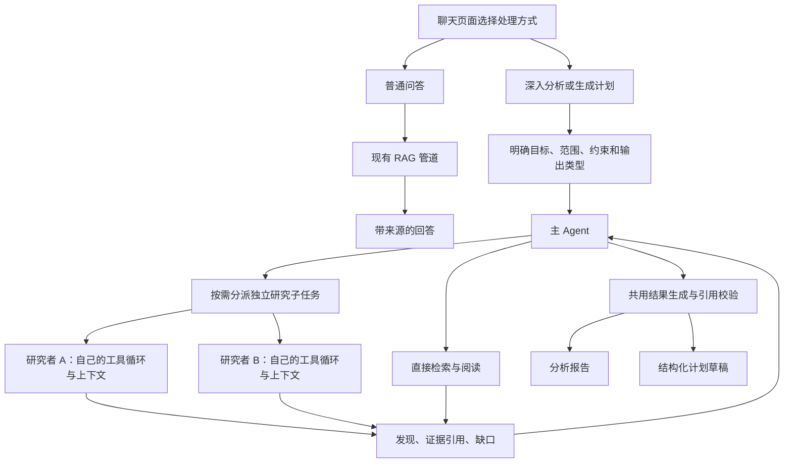

# 统一研究 Agent 与计划草稿改造实施计划

> 制定日期：2026-09-17。实施状态（2026-09-18）：P0—P8 已完成实现与本轮约定验证。P7 固定 400 问题/1200 任务全部记录，24 个应用/85 条引用与两例复测保留负结果；P8 四个真实演示请求、10 条引用已核对。173 个后端、28 个 Python 用例、前端构建、新库/重复升级和 9 项受控浏览器检查通过，app 24 项既有诊断保留。full 17517 任务仅准备；质量与失败见[固定对照](agentic-research-evaluation-report.md)、[应用原文](agentic-research-application-review.md)，接续见[执行记录](agentic-research-execution-log.md)与[交接](agentic-research-handoff.md)。
>
> 本文件是后续实施的主要交接入口。它记录本轮已经确定的产品方向、技术选择、删除范围、数据准备、阶段提交和验证方式。后续无需重新阅读完整聊天，也不要重新把方向改回送检助手。
>
> 制定计划时只编写文档，没有删除代码、切换分支、提交 Git、下载数据或运行模型评测。后续实际实施以阶段状态和执行记录为准；文中的类、接口和配置若标为“拟新增”，不能据此视为已有实现。

## 1. 已确认的目标与实施原则

项目面向 Java 后端 / AI 应用开发求职。主线调整为：基于文档知识库回答问题，并对复杂问题进行有依据的多文档研究；用户需要计划时，由同一研究流程整理结构化计划草稿。

已确认的产品分工：

| 请求 | 处理路径 | 产物 |
| --- | --- | --- |
| 普通问答，例如查询一个要求或参数 | 现有 RAG 检索与回答 | 带来源的答案 |
| 深入分析，例如比较两种方法的适用条件与限制 | 主 Agent 组织检索、读原文、补查，按需分派研究子 Agent | 带引用的分析报告 |
| 生成计划，例如按资料整理实验准备与操作步骤 | 同一研究流程，从开始就围绕计划需要的信息查资料 | 结构化计划草稿 |

这里的“同一流程”指共用执行机制与工具；不同用户、会话和任务仍有独立状态。不会让普通简单问题固定经过多个 Agent，也不再单独建设一个计划生成 Agent。

实施原则：

1. 可以替换现有技术，不以保留旧实现为目标；采用成熟项目中与问题直接相关的部分。
2. 移除送检助手、工位预约、模拟执行和 ROS 演示等偏离新主线的能力。保留计划草稿的业务用途，重组其实现。
3. 用公开数据构建可重复运行的资料库，下载由用户协助，转换、导入和测试工具由实施者完成。
4. 使用独立功能分支，按阶段提交；每个阶段留下修改内容、验证结果和后续入口。
5. **不设置“某项效果指标下降就停止改造”的项目推进条件。** 指标变化用于解释问题、修复实现和记录取舍，不能成为自动放弃后续阶段的理由。
6. 编译错误、引用错配、越权读取等明确缺陷仍要修复。缺少下载数据或模型凭证时，先推进不依赖它们的工作，真实验证保留为未完成事项，不能以模拟结果冒充。
7. 单次运行的超时、取消、调用额度和上下文限制仍需实现。这些约束用于控制请求资源，与第 5 条的项目推进规则不同。
8. 本轮交付以 P0—P8 为范围；完整目录树检索、通用 Agent 平台和自动业务执行不属于这轮交付。后续调整方案时，在本文件记录原因和替代方案，不根据单项指标静默删减已约定功能。

## 2. 制定计划时的仓库基线

已现场核对的基线：

- 仓库：/home/sd101t/IdeaProjects/ragent-iron-ore-rag。
- 当前分支：research/iron-ore-rag，领先远端 4 个提交。
- 当前 HEAD：a7ef618，提交标题为 fix: add md and png
- Java 17、Spring Boot 3.5.7；Maven 模块包括 bootstrap、framework、infra-ai、mcp-server；前端为 React / TypeScript。

这些是本文件制定时的快照，开始实施时应重新读取 Git 状态，不能假定工作区没有变化。

关键代码与现状：

| 入口 / 文件 | 当前行为 | 改造关系 |
| --- | --- | --- |
| [StreamChatPipeline](../../bootstrap/src/main/java/com/nageoffer/ai/ragent/rag/service/pipeline/StreamChatPipeline.java) | 改写、意图识别、一次检索后流式生成回答 | 保留普通问答，复杂请求走新增研究服务 |
| [RetrievalEngine](../../bootstrap/src/main/java/com/nageoffer/ai/ragent/rag/core/retrieval/RetrievalEngine.java) | 同时组织知识库检索和已有 MCP 调用 | 不直接整条递归调用，抽取纯知识检索入口 |
| [MultiChannelRetrievalEngine](../../bootstrap/src/main/java/com/nageoffer/ai/ragent/rag/core/retrieval/MultiChannelRetrievalEngine.java) | 已有知识库范围、召回通道和后处理能力 | 作为新 search_knowledge 工具的主要复用基础 |
| [KnowledgeChunkDO](../../bootstrap/src/main/java/com/nageoffer/ai/ragent/knowledge/dao/entity/KnowledgeChunkDO.java) | 保存 docId、chunkIndex、正文、hash、来源 metadata | 支持按证据标识读取正文和有依据的邻接内容 |
| [LLMService](../../infra-ai/src/main/java/com/nageoffer/ai/ragent/infra/chat/LLMService.java) | chat 返回字符串，另有流式回答接口 | 普通问答继续用；研究分支使用原生工具调用模型适配 |
| [原 TaskAgentController（P1 已退役）](agentic-research-execution-log.md) | 制定时为独立送检、样品、工位、任务推进与确认入口 | 整条业务链退役；历史源码见起始提交 |
| [原 TaskAgentStore（P1 已退役）](agentic-research-execution-log.md) | 制定时已有归属、短事务、租约、事件等实现 | 执行记录保存必要机制供 P3 重建，不沿用送检状态对象 |
| [原 IronOreTaskTemplateService（P5 已退役）](agentic-research-execution-log.md) | 从一条回答的单文档证据生成草稿，与审批及模拟逻辑共处一类 | 拆出生成与校验能力，改为接收研究任务的多文档证据 |
| [原 IronOreTaskSection（P5 已退役）](agentic-research-execution-log.md) | 草稿、批准、模拟、机器人操作混在同一组件 | 替换为只展示研究结果和计划草稿的组件 |

现有 GroundingChunk 和 SourceRef 是各自用途的证据摘录，不能当作整份原文；引用 ID 校验也不等于语义支持校验。新方案要直接保存本次研究真正读过的文本与来源。

## 3. 目标架构与技术选择

主 Agent 的研究任务划分属于执行过程；用户要的“计划草稿”属于业务产物。代码和界面分别使用 ResearchTask 与 PlanDraft 命名，避免把两种“计划”混为一谈。

### 3.1 本轮默认技术方案

| 部分 | 决定 | 原因 |
| --- | --- | --- |
| Agent 基础能力 | AgentScope Java 轻量核心 + 一个模型扩展 | 复用成熟工具调用与 ReAct 能力，减少继续维护文本 JSON 决策协议的工作 |
| 框架版本 | 以已核对的 v2.0.1 正式版为接入基准，P0/P3 记录实际 Maven 解析版本 | 固定可重现版本，不直接依赖 main 或 SNAPSHOT；不要求追最新版本 |
| 依赖范围 | agentscope-core；初始使用 agentscope-extensions-model-openai 接入兼容端点 | 本轮不引入完整 HarnessAgent、文件系统沙箱、技能市场或分布式 Agent 服务 |
| 业务编排 | Spring 服务管理任务、受控线程池执行子任务 | 让取消、用户归属、数据库事务和状态更新仍由 Java 服务明确负责 |
| 检索 | 复用 PGVector、现有重排和可用的知识检索接口 | 不因增加 Agent 更换向量库，也不要求同时启用所有召回通道 |
| 读取原文 | 基于存储正文与来源定位的 read_source | 第一版完成可靠展开，不建设全量 PageIndex 目录树 |
| 状态与证据 | 复用现有 PostgreSQL，新增少量业务表 | 不增加新的数据库或工作流中间件 |
| 前端 | 复用聊天、来源预览和会话列表 | 不再提供独立送检工作台 |
| 离线数据工具 | Python 转换、导入和评分脚本 | 仅用于开发与评测，不增加在线 Python 服务 |

AgentScope v2.0.1 的官方说明支持 JDK 17，并允许只依赖 core；其模型提供方在独立模块中。正式接入需核对锁定版本的 API、依赖冲突和实际工具调用行为，不能混用 v1 示例或把框架能力直接当作本项目已完成能力。[AgentScope Java v2.0.1](https://github.com/agentscope-ai/agentscope-java/tree/v2.0.1)、[Agent 文档](https://java.agentscope.io/v2/en/docs/building-blocks/agent)

新增 ResearchModelFactory 作为研究分支的薄适配层，从现有模型配置读取端点、模型 ID 和凭证，创建 SDK 模型；不在多个配置文件重复写密钥。只对支持工具调用的模型启用研究模式，回退模型也必须具备对应能力。若某兼容端点存在协议差异，修正这一适配层；普通问答的 LLMService 不必整体迁移。

同一批对照使用一致的实际模型与提示词版本。模型可配置，报告记录真实 model ID；不在业务代码中散落固定模型名称。

2026-09-17 补充：用户已确认首期研究与架构对照使用百炼 `qwen3.7-flash-2026-07-15`，复用 `BAILIAN_API_KEY`。这与当前配置中的 `qwen-flash` 是不同模型，需在实施时显式接入；本次只更新计划，没有切换运行配置。模型选择、费用假设和评测留档要求见[评测与预算补充](agentic-research-evaluation-and-budget-2026-09-17.md)。

### 3.2 借鉴哪些实现

| 参考 | 借鉴的部分 | 本项目的取舍 |
| --- | --- | --- |
| [Open Deep Research 核心代码](https://github.com/langchain-ai/open_deep_research/blob/main/src/open_deep_research/deep_researcher.py) | supervisor_tools 分派与并发限制，researcher_tools 工具循环，compress_research 压缩结果 | 在 Java 中实现对应职责；只给主 Agent 返回结构化发现和证据，不搬整套 Python 服务 |
| [Anthropic 多 Agent 研究系统](https://www.anthropic.com/engineering/multi-agent-research-system) | 对独立方向并行探索，隔离上下文，明确委派任务 | 串行依赖问题仍顺序研究，不把所有多跳题都强制拆为并行 Agent |
| [RAGFlow Agentic RAG](https://github.com/infiniflow/ragflow/blob/main/rag/advanced_rag/agentic_rag_graph.py) | 根据已有证据与缺口继续检索，累积研究结果并管理执行预算 | 保留轻量补查循环，不照搬所有模式和复杂图节点 |
| [CRAG 论文](https://arxiv.org/abs/2401.15884) | 检索质量不足时采取纠正动作的思路 | 不训练论文中的评估器，不声称复现 CRAG；第一版的补查由研究过程决定 |
| [PageIndex 检索示例](https://docs.pageindex.ai/tutorials/tree-search) | 在定位资料后继续阅读文档结构，支持混合检索思路 | 先完成 read_source；完整树索引列为后续可选替代方案，不作为本轮依赖 |

参考资料核对日期为 2026-09-17。实施时记录实际参考的 tag / commit 或访问日期；这些项目的效果数字不作为本项目效果。若实际复制代码，需要保留相应许可证和版权说明。

## 4. 产品行为与关键契约

### 4.1 用户入口

聊天页面提供“普通问答 / 深入分析 / 生成计划”三个清晰选项。第一版由用户选择，避免再增加一个复杂度分类模型。

- 普通问答继续调用现有 /rag/v3/chat。
- 深入分析和生成计划调用同一个研究接口，仅 outputType 分别为 REPORT、PLAN。
- 现有 deepThinking 参数属于模型推理设置，不能直接改作“研究模式”的开关。
- 缺少真正影响结果的用户条件时，主 Agent 提出一个明确问题并等待输入；资料中找不到的要求列为缺口，不强制用户补充不存在的企业数据。
- 计划类型在研究开始时就定义需要覆盖的条件、步骤、资源、限制；不能研究结束后才把普通回答机械转换成 JSON。

拟新增接口：

| 接口 | 语义 |
| --- | --- |
| POST /rag/research/runs | 创建并调度任务，返回 runId；同用户 clientRequestId 幂等 |
| GET /rag/research/runs/{runId} | 读取阶段、任务摘要、最终结果和缺口 |
| GET /rag/research/runs/{runId}/events | 订阅进度；连接建立和重连本身不得重复启动任务 |
| POST /rag/research/runs/{runId}/input | 在等待输入时补充条件，通过 revision 检查后继续 |
| POST /rag/research/runs/{runId}/cancel | 幂等取消整个研究，包括子任务与后续生成 |

所有接口验证任务归属。用户补充资料导致范围变化时，重新核对受影响的证据；本轮不建设复杂的多人审批或计划版本管理产品。

### 4.2 角色与工具

**主 Agent**负责理解研究目标、直接查询、分派独立任务、整合结果和决定何时形成产物。简单的研究任务可以由主 Agent 自己完成。**研究子 Agent**拥有独立的子目标、工具循环和上下文，只允许一层委派，不继续生成孙 Agent。

工具采用原生 Tool Calling，建议契约如下，具体 Java 命名可按项目风格调整：

| 工具 | 输入 | 返回 | 约束 |
| --- | --- | --- | --- |
| search_knowledge | query、允许范围内的文档筛选、期望条数 | 候选 evidenceId、摘要、来源、截断标记 | 实际知识库范围由服务端计算，不能被模型参数放大 |
| read_source | evidenceId、展开模式或受限范围 | 正文片段、位置、版本/hash、是否仍被截断 | 从服务端证据记录解析来源，不接受任意文件路径或 URL |
| conduct_research | 子目标、比较维度、范围、预期返回内容 | SubtaskResult | 主 Agent 专用，由执行器限并发；优先一次提交多个独立子任务 |
| ask_user | 缺少的条件、一个明确问题 | WAITING_INPUT 状态 | 主 Agent 专用；子 Agent 以 gaps 返回疑问 |
| finish_research | 已完成维度、未解决事项 | 进入生成阶段 | 最终引用与结构仍由程序检查 |

本轮不开放任意代码执行、任意网络访问、数据库写入工具或通用 MCP 工具列表。公共资料先导入知识库，在线研究围绕这批可追溯资料进行。

**纯检索入口的边界：**新 KnowledgeSearchService 复用 MultiChannelRetrievalEngine 的知识检索能力，并传入明确作用域；必要时为该入口增加接受 allowedScope 的重载，让范围限制在召回前生效，而非仅在 TopK 结果上事后过滤。不要调用整个聊天流程，也不要因复用 RetrievalEngine 而间接执行原有业务 MCP 工具。意图分类结果可以辅助搜索范围，但不是权限凭证。若当前知识库采用全局共享规则，应按真实规则实现并记录，不能宣称已有租户级文档权限。

### 4.3 研究上下文与证据

每个子 Agent 只接收目标、约束、允许范围、相关证据和自身工具历史。主 Agent 接收子任务结果，不合并所有子 Agent 的完整对话历史。

建议的 SubtaskResult：

~~~json
{
  "taskId": "subtask-a",
  "findings": [
    {"statement": "资料中明确说明的发现", "evidenceIds": ["ev-..."]}
  ],
  "gaps": ["尚未找到的条件"],
  "conflicts": [],
  "status": "COMPLETED"
}
~~~

压缩结果不得丢失支撑结论的数字、单位、适用条件和证据 ID。根据规模在子任务结束时压缩一次；不要为每次工具调用再增加一轮总结模型。

服务端 EvidenceRecord 至少包含：runId、evidenceId、kbId、docId、documentVersion、chunkIds、contentHash、实际提供给模型的文本、来源位置、retrievedByTaskId。章节、页码、单元格和原始数据段落 ID 按资料实际存在的字段保存，禁止编造位置。

- evidenceId 在同一任务内稳定且全局唯一；不能让不同子任务各自生成含义不同的“E1”。
- 去重依据包含文档、版本或内容 hash、源片段身份；不同版本不直接合并。
- search 返回摘要时要标注截断；read_source 从数据库正文展开，不能把 GroundingChunk 再包装为“全文”。
- 邻接读取必须依据 chunkIndex 和真实来源 metadata；跨工作表、不同章节和不同版本不能盲目拼接。
- 数据集片段不一定是完整原文。MuSiQue 只有提供的段落时，返回 available_excerpt，不能伪装成整篇 Wikipedia。
- 新数据导入时保存 sectionPath、sourceParagraphId 等定位信息。旧数据缺失时先支持可信的块级读取，不推断不存在的章节关系。
- 同一任务优先使用已保存的证据快照；回读时发现源文档变化则明确标记，不悄悄混用新旧版本。
- 资料文本只作为证据，不能改变工具定义、访问范围或系统指令。

最终统一生成展示用引用编号，保证正文、来源面板和落库记录指向同一批证据。程序验证引用存在、属于本次任务且确实被读取；语义支持仍需通过真实样例和评分分析，不能用 ID 存在冒充内容正确。

### 4.4 产物生成

最终生成是同一流程末尾的调用，不再建立“写作 Agent → 审稿 Agent → 计划 Agent”链条。

| REPORT | PLAN |
| --- | --- |
| 回答目标、主要结论、比较维度、适用条件、证据、缺口 | 目标、用户约束、前置条件、步骤、设备/材料、参数、注意事项、待确认项、证据 |
| 资料冲突时分别展示适用范围与出处 | 文档未提供的参数留空或标注待确认，不补造执行要求 |
| 可用 Markdown 展示 | 使用结构化 JSON 校验后展示为计划卡片 |

拟提取 PlanDraftGenerator 和 PlanDraftValidator，输入为 ResearchBrief + Findings + EvidenceRecords；不再依赖 sourceMessageId + 单个 docId。可复用 TaskTemplatePayload 的合理字段和 TaskTemplateValidator 的结构检查，但删除模拟执行状态的耦合。

参数、操作要求等关键字段应能绑定证据；用户自行提出的限制保存 user_input 来源，不伪装为文档事实。结构错误或非法引用允许有限修复，修复仍计入运行预算。计划表示可核对的草稿，不自动转换成已获批准的业务动作。

普通问答保持现有 SSE。研究过程实时发送阶段和工具进度；REPORT 和 PLAN 均先在内部生成、完成结构与引用校验，再通过 artifact 事件发布完整结果。REPORT 可先生成 sections（text + evidenceIds）的结构，程序映射引用并渲染 Markdown；PLAN 校验后展示计划卡片。这样不必在未经校验的文字已经发出后补做撤回，也不为追求逐字输出增加一条生成链。第一版不承诺最终报告的 token 实时展示。

### 4.5 执行状态与 Java 后端边界

建议使用三张新表，避免一开始建设通用工作流库：

- t_research_run：owner、conversationId、clientRequestId、outputType、status、brief、subtasks/state JSON、最终 artifact JSON、revision、lease/epoch、usage、错误摘要和时间。
- t_research_evidence：任务证据快照与定位信息；对子任务共用，按证据身份去重。
- t_research_event：runId、递增 sequence、taskId、事件类型、可展示摘要、时间。只持久化阶段/工具事件与结果，不为每个 token 插入一行。

状态包括 QUEUED、RUNNING、WAITING_INPUT、COMPLETED、PARTIAL、FAILED、CANCELLED、INTERRUPTED。COMPLETED 只表示流程正常形成产物，不表示资料完整或结论必然正确。PARTIAL 用于预算或部分子任务失败后仍形成可用结果的情况。

实现要求：

1. 同一个用户的 clientRequestId 唯一；刷新或重连不创建重复执行。
2. 模型调用不放在长数据库事务中；领取任务、写事件、保存结果使用短事务。
3. 取消与正常结束竞争时，更新必须检查运行状态与 epoch/revision。被取消或过期执行的迟到结果不得覆盖终态。
4. 取消传播给 SDK / HTTP 调用句柄、子任务和生成阶段；仅 CompletableFuture.cancel 不代表供应商已停止计算，分别记录取消请求与本地结束。
5. 主任务与子任务避免占用同一个有界线程池相互等待；模型请求并发额外通过共享配额控制。
6. 任一子任务失败不直接丢弃其他成功结果，主 Agent 接收结构化失败信息并决定补查或说明缺口。
7. 进度订阅与执行生命周期分开：研究 SSE 断线后可继续持久任务，重新打开时读取状态与最终结果；用户主动停止才取消整个研究。设置明确的运行时限避免孤儿任务无限执行。
8. 重启后将失去执行者的任务标记为 INTERRUPTED，并保留已有证据、子任务结果和错误信息。第一版支持重新发起任务，不承诺从模型中间 token 精确恢复，也不实现跨节点调度平台。
9. 事件写入按 runId 原子分配序号，不让并行研究者按读取到的旧最大值自行递增。
10. 运行摘要与工具结果可以展示；不保存或展示模型的隐藏推理过程。

建议的初始运行配置如下，属于待实测调整的默认值，不是项目继续实施的效果门槛：

~~~yaml
research:
  max-concurrent-workers: 2
  max-total-workers: 4
  max-model-calls: 16
  max-tool-calls: 24
  max-duration-seconds: 300
  model-call-timeout-seconds: 60
  tool-timeout-seconds: 30
  reserved-finalization-model-calls: 2
~~~

全局预算必须覆盖主 Agent、子 Agent、总结、修复与最终生成，不能给每个子任务分别发一整份全局额度。模型输入还需按所选模型上下文容量裁剪，优先保留目标、约束、关键证据与未解决问题。实际 token 用量优先取供应商返回值，估算值单独标记。

## 5. 明确的保留、替换和删除清单

| 对象 | 处理 | 说明 |
| --- | --- | --- |
| ironore/agent 送检包及 TaskAgentController | 删除 | 包括样品、工位、送检登记、种子数据与文本 JSON 决策循环；必要执行机制迁入研究服务后不保留两套运行器 |
| TaskAgentPage、taskAgentService、相关路由/侧边栏/类型 | 删除 | 不再保留独立送检助手入口 |
| prompt/iron-ore-task-agent.st 及送检专用测试 | 删除 | 替换为研究目标、工具、研究者与输出提示词和对应测试 |
| RobotMissionController/Service/Compiler、RobotGateway*、RobotMission*、对应 DAO 与配置 | 删除 | 与新主线无关 |
| robot-gateway/、机器人专用测试和启动说明 | 删除运行内容，历史设计记录保留为历史 | 不维护 ROS 环境 |
| IronOreTaskSimulationToolExecutor、TaskExecution*、模拟执行接口和前端按钮 | 删除 | 计划草稿不再假装进入真实执行流程 |
| IronOreTaskTemplateService、TaskTemplatePayload、TaskTemplateValidator | 拆分并替换 | 迁移草稿生成/校验；研究产物使用新统一存储，旧模拟和审批耦合移除 |
| IronOreTaskSection、ironOreService 中的旧任务功能 | 替换 | 新研究结果与计划卡片组件；版本比较接口按实际引用保留 |
| 文档导入、PDF/XLSX 处理、来源与版本信息 | 保留 | 是研究过程读取和引用资料的基础 |
| 普通问答、检索与重排、会话、登录、来源预览 | 保留 | 避免把本轮变成基础系统重写 |
| WorkbookDiffService 与文档版本比较 | 保留现有能力 | 本轮不扩成“变化影响 Agent”，不强制挂入研究工具 |
| 历史评测结果、变更说明 | 保留并标记适用版本 | 不删除负面结果来美化项目，不把旧结果用于新能力背书 |
| GraphRAG、Milvus、通用 MCP 等原有可选基础能力 | 本轮不新增使用；只清理确定无引用的送检/机器人注册 | 不为缩小项目启动另一轮全仓框架拆除 |
| 已不被任何保留路径使用的配置、Bean、类型、脚本 | 在 P8 删除 | 通过引用检查和编译确认；不要仅因名称含 agent、task 或 plan 就删除 |

删除需要同时检查后端依赖注入、工具注册、前端 import/route、配置、SQL 资源打包和测试。当前 bootstrap/pom.xml 显式打包 260915_task_agent.sql，不能只删除 Java 类。

数据库按两种场景处理：新建环境的 schema_pg.sql 去掉退役模块建表/注释并加入新研究表；已有数据库通过新增升级脚本创建研究表，旧表停止使用，**不在应用启动时自动 DROP 既有数据**。历史升级脚本保留为历史，不伪造已经执行过的迁移。数据库整理与代码删除是不同动作。

## 6. 数据集、下载分工与导入约定

### 6.1 首选数据集

| 数据 | 用途 | 下载入口与说明 |
| --- | --- | --- |
| QASPER | 长文档阅读、章节定位、回答与证据选择、不可回答问题 | [官方数据卡](https://huggingface.co/datasets/allenai/qasper)；包含 1,585 篇 NLP 论文及 5,049 个问题，带支持证据。优先下载下述 Parquet 分支 |
| MuSiQue v1.0 | 后续查询依赖前面发现的多跳问题，以及不可回答情况 | [作者仓库](https://github.com/StonyBrookNLP/musique)、[作者下载脚本](https://github.com/StonyBrookNLP/musique/blob/main/download_data.sh)；下载 musique_v1.0.zip，保留 Ans / Full 的训练和开发文件 |
| HotpotQA（补充） | 复用仓库已有数据工具，扩大检索候选池与多跳回归 | [官方主页](https://hotpotqa.github.io/)；已有数据可继续用，不必重复下载；全 Wikipedia 不是本轮必需项 |

QASPER 单篇论文问答不能单独证明跨文档多 Agent 的价值；MuSiQue 多跳题也不必然适合并行。跨文档比较和计划草稿另设应用样例，不能混用各类指标。

QASPER 和 MuSiQue 的官方页面标注 CC BY 4.0；保留数据集出处及许可文件。HotpotQA 使用它的官方许可说明，不能假定所有公开材料采用同一许可证。

### 6.2 用户可以先完成的下载

下载完整原始数据，由实施者转换；用户不需要手工切分、标注或逐条发送数据内容。

1. **QASPER**：打开 [Parquet 转换分支](https://huggingface.co/datasets/allenai/qasper/tree/refs%2Fconvert%2Fparquet/qasper)，下载 train、validation、test 目录下的全部 Parquet 分片并保留目录结构。2026-09-17 查看时转换分支总量约 26 MB；main 分支主要是加载脚本和说明，单独下载 main 不能视为下载了全文数据。
2. **MuSiQue**：按作者下载脚本中的 [数据压缩包链接](https://drive.google.com/file/d/1tGdADlNjWFaHLeZZGShh2IRcpO6Lv24h/view)下载 musique_v1.0.zip，保留压缩包和解压后的 JSONL。关键文件包括 musique_ans_v1.0_train.jsonl、musique_ans_v1.0_dev.jsonl、musique_full_v1.0_train.jsonl、musique_full_v1.0_dev.jsonl。
3. HotpotQA 仅在需要扩展时下载官方训练集和带答案的开发集；不要把不公开答案的测试集当作可本地完整评分的集合。

建议存放到仓库已忽略的 local-data 目录：

~~~text
local-data/agentic-research/
  raw/qasper/{train,validation,test}/
  raw/musique/musique_v1.0.zip
  raw/musique/data/
  raw/hotpot/                         # 可选
  prepared/
  runs/
~~~

也可存到其他磁盘，通过 AGENTIC_DATA_ROOT 指定。用户后续只需告知路径与下载完成情况，不必把压缩包或大段内容放入对话。下载未完成时继续实现接口和小型固定样例，不让下载工作阻塞所有开发。

### 6.3 实施者负责的数据处理

P2 第三批已新增 [eval/agentic-research/](../../eval/agentic-research/README.md)，复用现有分批 Parquet 读取及文件指纹函数，实现以下转换、字段隔离与固定抽样要求；第四批已补齐真实摄取、身份映射、幂等批次和逐请求 usage，四个训练/开发 split 的完整导入及 search/read 验收通过。整体约定如下。

- 记录原始文件名、大小、SHA-256、数据集版本/来源、split、转换脚本版本和语料条数，形成 manifest。
- 把语料与问题标注分开：corpus.jsonl 保存可检索正文；questions.jsonl 保存问题、答案和 gold evidence，只供评测器使用。
- **问题答案、支持段落标记、MuSiQue 的 gold decomposition 等标注不得进入知识库、提示词或查询规划器。**
- QASPER 保留 paperId、sectionName、原始段落顺序和映射；只把正文及真实表格内容导入知识库。
- MuSiQue 保留文章标题和原始段落身份；合并候选段落时按标题与内容 hash 去重，不能只凭标题拼出不存在的完整文章。
- 聚合多个问题提供的候选上下文后，明确标注为 pooled-context 检索；只在每题提供的候选中搜索则标注为 distractor。两者都不能称为 fullwiki。
- 使用 train 数据开发提示词；validation/dev 固定抽样与更大规模评分。QASPER test 仅在最终配置确定后使用，不能一边调整一边称为独立测试。
- 沿用真实入库链生成向量与重排输入；批量导入支持幂等、分批重试和进度统计，避免要求用户手动上传数千篇文档。
- 数据读取以流式/分批处理为主。检查样本时输出统计和少量行，不向模型上下文灌入整份数据集。

批处理规模分成 smoke（约 20 题）、regression（QASPER 与 MuSiQue 各固定约 200 题）、full（所选完整带标注 split）三个运行配置。完整语料可以先导入，模型回答按批执行；每份报告明确真实运行规模。提供 full 的执行能力不等于已经跑完全量。

### 6.4 计划与跨文档比较样例

第一版准备约 12 个跨文档比较任务和 12 个计划任务，覆盖条件明确、需要补查、资料不足、来源冲突和用户补充条件。它们是应用回归样例，不冒充公开基准。

可先用同主题公开论文：比较两篇论文的方法前提、实验设置和限制；根据论文明确披露的实验流程整理复现实验准备草稿。原有工业资料仍可提供少量中文演示。缺失的步骤、参数明确列入待确认项，不能为了生成完整计划而补造细节。

每个样例记录用户目标、可用资料、应覆盖维度、可定位证据和已知缺口。可以由模型辅助起草样例，但最终参考依据需要核对原文，不能只用同一模型评价自己生成的答案。公开英文结果与工业中文演示分别报告。

### 6.5 已下载数据的核对记录

2026-09-17 已核对实际目录 `local-data/agentic-research/raw/`：QASPER 共 1,585 篇论文、5,049 个问题；MuSiQue Ans 的 train/dev 分别有 19,938/2,417 题，Full 的 train/dev 分别有 39,876/4,834 题。Full 包含 Ans 的可回答题，不能相加为独立样本总数；MuSiQue test 文件没有答案字段，不能直接计算本地 gold 答案指标。

原始文件大小、SHA-256 和实际条数已保存到本地 `local-data/agentic-research/manifests/source-inventory-2026-09-17.json`。该记录只证明下载清点。P2 第三批已转换完整 QASPER train/validation 与 MuSiQue Full train/dev，实际条数、来源、转换源码及产物指纹见[转换清单](../../eval/agentic-research/manifests/prepared-development-2026-09-17.json)；真实 test 未转换。第四批已用真实 embedding 完成这四个 split 的完整摄取和搜索/阅读验收，合计 122,620 个文档、182,768 个来源段落、182,896 个实际块/向量，见[导入清单](../../eval/agentic-research/manifests/imported-development-2026-09-17.json)。没有问答质量评分，原始及转换大文件继续留在 Git 忽略目录。

## 7. 分阶段实施与提交

以下阶段按依赖顺序推进，数据下载可与开发并行。估计完整实现与整理约 7—10 个工作日，实际取决于模型接口、数据导入速度和遗留耦合；此估计不是到期自动停止或删功能的规则。

### P0：建立实施分支、基线与执行记录

**工作：**

- 重新读取本文件、Git 状态与 HEAD；记录已存在的修改，避免覆盖用户 WIP。
- 新建 feat/agentic-research 分支；如果同名分支已存在，先核对其用途与提交，不直接重置。
- 将本计划纳入本轮文档提交，创建 agentic-research-execution-log.md，记录环境、现有功能入口、准备采用的模型和依赖版本。
- 检查 AgentScope v2.0.1 的 Maven 坐标和 Java 17 兼容性，固定版本；仅需完成接入准备，不做框架海选。
- 记录基础编译、现有相关测试和前端构建状态；已有失败与新引入失败分开。

**完成证据：**分支已建立，WIP 清单、构建命令及实际结果、数据路径状态可以从文件恢复。

**建议提交：**docs: record agentic research implementation baseline

### P1：移除送检和执行演示，保留草稿最小能力

**工作：**

- 按第 5 节删除送检后端、页面、工具、种子数据与专用测试。
- 删除模拟执行和 ROS 派发链路，清理配置、前端类型与接口。
- 先将旧草稿生成与其校验拆开，解除对 TaskExecutionMapper 等执行对象的依赖；在新输出接入前允许临时保留旧草稿入口。
- 清理全新环境中的退役建表与资源初始化引用，保留历史升级脚本；新增环境与既有环境分别说明。旧 t_iron_ore_task_template 表在 P5 完成替代前保留，不能在 P1 就让暂存草稿入口失去表结构。
- 将旧 Agent 中必要的租约/迟到写保护行为写入执行记录，然后在 P1 删除旧业务运行器；P3 根据记录实现对应运行器测试，避免两套常驻实现。P1 不提交依赖尚未实现新类而无法运行的测试。

**完成证据：**普通问答、文档管理、版本比较和暂存草稿入口可以构建运行；前端没有送检/模拟/机器人按钮；相关路由和 Bean 引用已清理。

**建议提交：**refactor: retire inspection and robot execution demos

### P2：数据适配、统一证据与检索阅读工具

**当前状态（2026-09-17）：已完成。** 已实现 ResearchBrief / EvidenceRecord / SubtaskResult、KnowledgeSearchService、SourceReader，任务/证据/事件及来源映射表。第二批加入文档限制、可靠邻块与首次快照复用，Java 存储及来源事务已在隔离 PostgreSQL 联调。第三批完成 QASPER/MuSiQue 训练/开发转换、20/200 固定抽样、gold-free queries 和完整字段/来源校验，真实开发 split 重跑逐字节一致。第四批完成实际 metadata 摄取、稳定主键映射与幂等批量导入；四个完整训练/开发 split 的来源/向量审计、实际 scoped search/read、越界与缺失来源检查均通过。工具当前是 Java 服务；新研究 Agent 与 SDK 工具注册在 P3 接续。

**工作：**

- 增加 ResearchBrief、EvidenceRecord、SubtaskResult 等明确的数据契约。
- 完成 KnowledgeSearchService、SourceReader 与作用域检查，暴露 search_knowledge / read_source。
- 支持多文档证据、原文展开、截断说明、稳定 ID 和来源定位。
- 完成 QASPER、MuSiQue 转换与幂等导入工具；保留旧数据工具中可复用的部分。
- 加入任务、证据、事件表的增量 SQL，明确本仓库的执行方式；不假定文件放入目录后会被 Flyway 自动执行。

**完成证据：**两种数据格式能用小样例导入；真实数据可用时完成批量导入；工具返回真实正文及可回查位置；答案标注未混入检索库；作用域与不存在来源的错误行为明确。

**建议提交：**feat: add research evidence tools and dataset adapters

### P3：接入 AgentScope 与单研究任务运行闭环

**当前状态（2026-09-17）：已完成。** 轻量 SDK 与独立 research-flash 配置已启用，实际模型为 `qwen3.7-flash-2026-07-15`；四个原生 search/read/ask/finish 工具复用 P2 证据服务。创建后自行执行，GET 查询不重复调度；用户回复通过 revision 校验恢复，累计调用额度保持不变。PostgreSQL 幂等、短事务、租约/epoch、取消和重启保护完成，最新后端回归 149/149。真实联调保留各批失败及修复记录，覆盖查找、依赖阅读的补查、资料不足、追问恢复与取消，见[联调清单](../../eval/agentic-research/manifests/research-p3-smoke-2026-09-17.json)。P3 的 COMPLETED 仅表示 `state.researchResult` 中有通过已读引用身份检查的研究摘要，`artifact` 为空；不是 P5 最终报告/计划已生成。事件接口暂为分页 JSON，SSE 在 P6 接续；本阶段无多 Agent、质量评分或全套 Web E2E。

**工作：**

- 增加 ResearchModelFactory、ResearchAgentFactory，使用锁定版本的原生工具调用。
- 完成 ResearchRunService / Store、ResearchBudget、取消控制、事件和短事务写入。
- 主 Agent 能选择 search/read、根据观察继续查、提出必要追问或结束研究。
- 通过实际模型验证 tool_call_id、工具参数、工具结果回传和错误处理；文本 JSON 不能静默冒充原生工具调用成功。
- 完成研究创建、查询、补充输入、取消接口；任务执行不依赖前端反复点击 advance。
- 先做到一个研究者可独立完成串行多跳问题，不在此阶段混入多 Agent 并发故障。

**完成证据：**真实模型的一次查找、依赖前次结果的补查、资料不足、等待输入与取消路径可回放；模拟测试证明的程序机制与真实模型行为分别记录。

**建议提交：**feat: implement bounded research runs with native tool calls

### P4：主 Agent 委派与有限多 Agent

**当前状态（2026-09-17）：已完成。** `conduct_research` 批量委派明确子目标/维度/返回要求，仅主 Agent 可用。worker 拥有独立 Toolkit、上下文、已读证据与取消信号，专用池最多 2 个并行、每个运行累计最多 4 个、只允许一层委派。全部角色共用模型/工具/活动时长预算与模型并发配额，worker 最多 6 次模型请求并为主整合和后续生成保留额度。子任务结果/已读证明/事件由父 epoch 保护；失败、超时、重复回调和迟到返回不会覆盖其他成功结果。真实联调保留 A 批负结果；worker-v2 的比较和 PLAN 复测完成，补查压力样例两名 worker 均阅读后补查，其中一名预算退出，主结果 PARTIAL 且保留另一名发现；并行取消和串行多跳路径已验证。最新 165 个定向测试通过，质量评分与完整产物尚未执行。

**工作：**

- 增加 conduct_research 和独立子 Agent 上下文；支持最多两个研究者同时工作。
- 明确子任务目标、允许范围、预期维度和返回 schema，避免两个 Agent 重复搜索同一内容。
- 聚合结构化结果与共享证据标识；补查反馈由主 Agent 组织，子 Agent 不无限递归委派。
- 全局模型/工具额度原子分配，预留最终生成额度；任务池、HTTP 调用和取消信号正确关联。
- 串行依赖的研究继续顺序执行；比较任务按独立对象并行，必要时在发现共享前提后调整子任务。
- 处理一个研究者失败、超时、重复查询、取消后迟到返回以及重复回调。

**完成证据：**能从事件记录看出不同子任务各自进行了阅读与补查；父任务接收压缩结果；并发运行不会串上下文、超发预算或覆盖已取消结果。

**建议提交：**feat: orchestrate isolated research workers

### P5：统一报告与计划草稿输出

**当前状态：已实现，170 个程序回归通过；真实联调最新 REPORT 超时失败、PLAN 为 PARTIAL，未完成质量验收。** 共用 ResearchArtifactGenerator + PlanDraftValidator；不再设独立计划 Agent。失败样例、有限修复及原文支持边界见执行记录 P5/P6 补充记录。

**工作：**

- 完成共用结果生成输入和 REPORT / PLAN 两类输出。
- 迁入可用的计划字段与校验，解除旧单文档、单回答证据的限制。
- 计划前置条件和步骤绑定证据；用户约束与文档要求分开记录；缺失要求可明确留空。
- 来源编号由程序统一分配，JSON 与引用检查失败按预算修复，保留失败信息。
- 产物保存到研究任务并关联会话，删除替代完成后的旧计划生成/审批入口和重复数据访问代码；此时再从新建环境 schema 中移除旧计划表，既有数据库表按第 5 节处理。
- 计划草稿可以重新生成；本轮不恢复工位办理、执行模拟、机器人操作和复杂版本审批。

**完成证据：**同一研究执行机制可以产出报告与计划；计划引用来自多份真实资料；改 outputType 不会新建另一套 Agent 运行器。

**建议提交：**feat: generate reports and plan drafts from shared research

### P6：聊天入口、进度和来源展示

**当前状态：已实现，程序及本地受控浏览器验证通过。** 三种入口共用聊天页面；researchService 只读重连，ResearchProgress / PlanDraftCard 与现有来源面板接通。普通问答响应、认证、检索、阅读和模型在浏览器验收中受控，不代表完整生产 RAG 或真实供应商质量通过。实现和复现命令见执行记录 P6。

**工作：**

- 在 ChatInput / ChatPage 接入三个处理选项，保留现有普通问答。
- 新增 researchService 和 ResearchProgress / PlanDraftCard 等必要组件，复用来源面板和文档预览。
- 用户看到正在研究的子任务、查阅来源、缺口和结果，不展示模型隐藏推理或内部系统提示词。
- 完成流式进度、校验后发布的最终报告与计划卡片、取消、等待输入和重新打开读取结果。
- 前端订阅失败或重连不得重复启动模型任务；刷新可以取最终结果，不宣称支持逐 token 断点续播。

**完成证据：**普通问答、跨文档比较、计划草稿三个路径可在浏览器走通；取消和断线行为与接口语义一致。

**建议提交：**feat: integrate research and plan modes into chat

### P7：公开数据对照与故障路径验证

**当前状态（2026-09-18）：已完成。** 固定 smoke 120 和 regression 1200 个任务均真实记录；24 个应用原文核对、两例针对性复测、作者公式对齐及 10 项程序行为检查完成。A 是一次 scoped 检索的项目组件对照，完整生产普通聊天另有保留链回归；未包含其改写/意图/MCP/回退。失败计入评分，full 17517 任务仅准备。[结果与费用](agentic-research-evaluation-report.md)、[原文负例](agentic-research-application-review.md)及[验证边界](agentic-research-validation-report.md)均留档。阶段提交按唯一标题 `test: evaluate research outputs and execution reliability` 定位。

**工作：**

- 在同一份语料、模型和检索设置下运行普通 RAG、单研究 Agent、主 Agent 按需委派三种模式。
- 完成第 8 节的回答、证据、资源与故障测试；先 smoke，再固定 regression，提供 full 配置与执行方式。
- QASPER 使用数据集适合的答案与证据评分；MuSiQue 参考作者评价脚本，保留答案与支持证据映射。
- 完成比较/计划应用样例原文核对，记录缺口处理和不能回答的情况。
- 指标下降时分类定位、修复明显问题、补充针对性重跑；同时继续完成剩余接口、清理和交付事项。
- 最终记录实际运行范围、失败样例、模型调用成本和限制，不能只挑获胜的子集写报告。

**完成证据：**报告可由 manifest、配置和命令复现；没有运行的规模或故障场景明确标为未验证；回归结果不以提升承诺替代实测。

**建议提交：**test: evaluate research outputs and execution reliability

### P8：清理残留与交接

**当前状态（2026-09-18）：已完成。** 退役运行源码/配置/前端入口引用检查、启动/手工迁移/三入口/失败边界、首页与当前流程笔记、最终验证和四请求演示均已交付。真实演示为 2 COMPLETED/2 PARTIAL，10 条引用由 Codex 核对，未完成比较、遗漏 null 参数条目等负结果保留；不是生产页面 E2E 或独立盲评。P7 提交 `3381fa9`，P8 按唯一标题 `docs: finalize research workflow and implementation handoff` 定位。[交接清单](../../eval/agentic-research/manifests/research-p8-handoff-2026-09-18.json)记录实际范围。

**工作：**

- 检查是否残留旧运行器、旧计划接口、送检/机器人配置和前端入口；删除确认无用的代码与依赖。
- 整理启动方式、数据下载/导入、三个用户入口、配置含义、取消与故障边界。
- 更新项目说明与相关流程笔记，区分已完成实现和后续设计；修改原有 WIP 文档时保留用户内容，不能整篇覆盖。
- 输出一份最终验证报告和一个具体的端到端演示脚本，说明所用资料与问题。
- 更新本计划和执行记录，逐项填写完成情况、实际提交和未解决事项。

**完成证据：**新会话只读本文件、执行记录和 Git log 就能恢复进度；启动过程不再依赖送检或 ROS 组件；无已知新引入的构建和主要路径错误。

**建议提交：**docs: finalize research workflow and implementation handoff

## 8. 验证方式与指标下降后的处理

### 8.1 三种对照模式

| 模式 | 用途 | 必须固定或记录的条件 |
| --- | --- | --- |
| A：现有一次检索 RAG | 了解现有能力 | 语料、问题集、模型、检索配置、最终生成设置 |
| B：单研究 Agent | 观察多轮检索和原文阅读的作用 | 与 C 尽量使用相同的全局调用额度；保留实际 usage |
| C：主 Agent 按需委派 | 观察独立研究分工的作用 | 与 B 相同工具和证据范围；标注实际是否发生委派 |

不仅比较最终答案，也查看是否检索到了缺失证据、是否进行了有效补查、是否把无依据内容写入结果。A 的调用成本天然不同，应原样报告。C 超过 B 但花费更多时，同时展示成本，不能将差异直接归因为“多 Agent 一定更好”。

### 8.2 记录哪些结果

- 答案：数据集适合的 EM / F1、不可回答识别；长篇报告不强行使用短答案 EM 评分。
- 证据：支持证据覆盖、可定位比例、非法/错配引用；检索指标按具体语料与候选池设置命名。
- 应用产物：任务维度覆盖、有依据步骤、明确缺失项、资料冲突处理；样例核对标准随数据保存。
- 资源：实际模型调用、工具调用、token、耗时；样本量足够时报告 P50/P95，失败和超时不能从统计中悄悄剔除。
- 稳定性：模型/工具超时、子任务失败、断线、取消、重复提交、重启后的状态，以及跨用户访问。

模型辅助评分可以作为诊断信号，但不单独证明真实性。公共数据集的参考答案也只在其标注范围内有效；英文公开集结果不能改名为工业场景准确率。

### 8.3 必须覆盖的程序行为

1. 同一请求重复提交，只产生一个研究运行。
2. 两个用户不能读取彼此的研究状态、事件、证据或产物。
3. 子任务不能超出主任务允许的数据范围。
4. 一个 worker 超时，另一个已成功的结果可以保留。
5. 并发 worker 争用最后额度时不会超发；生成额度得到保留。
6. 取消与完成同时发生、旧 epoch 返回、客户端重复取消时，终态与结果一致。
7. 非法工具参数、虚构 evidenceId、源文档变化或停用得到明确处理。
8. SSE 重连不会再次调度任务；研究完成后能从数据库读取最终结果。
9. 普通问答、文档入库和版本比较不被新依赖或清理破坏。
10. 清洁建库与既有库增量升级都可得到研究表；升级不会自动删除已有业务数据。

### 8.4 不以指标下降终止推进

例如某一轮 Recall 或 F1 下降：先确认比较口径、语料快照与模型是否一致，再区分检索遗漏、工具失败、上下文压缩丢信息、生成错误或任务分派不当。修改对应环节，重跑受影响样例并记录结果；不能仅因低于旧结果就取消 P4—P8。

如果经过修复仍有取舍，保留完整结果，调整适用入口或默认策略。例如让串行多跳问题由单研究者处理、独立比较任务启用委派，是正常策略收敛；不能一边保留失败的通用宣传，一边隐藏失败样本。

本轮完成依据是约定能力和必要验证实际交付，不是预设“提升 X%”或“所有数据集都超过基线”。资源凭证缺失、数据不可用等外部限制应如实记录并继续可独立完成的工作，不能把未运行写成已通过。

### 8.5 评测留档与实际费用

用户要求保留实施、测试和评测记录，不能为了省 token 而跳过必要的真实模型验证。每批运行必须保存固定题目 ID、数据及代码版本、完整配置、逐题预测与得分、工具执行记录、逐次模型 usage、失败/重试与汇总报告；具体目录和字段见[评测与预算补充](agentic-research-evaluation-and-budget-2026-09-17.md)。

单元测试、模拟故障测试与真实 API 评测分别记录。结果下降和失败样本保留，不覆盖旧批次；报告说明真实运行规模，不能把 400 题抽样写成全量评测。约 100 元是首期充值建议，非已测得的项目总价；按实际 usage 校准后续费用。预算管理不改变 8.4 的原则，也不表示获得无限追加消费授权。

## 9. Git、命令与范围管理

当前制定计划阶段不执行以下命令；进入实施后使用。分支名可在冲突时添加日期后缀。

~~~bash
git status --short --branch
git log -5 --oneline
git switch -c feat/agentic-research
~~~

同目录切分支会保留原有 WIP，必须先登记；如果阶段修改与用户 WIP 重叠且难以拆分，使用独立 worktree 处理。不要为了获得干净状态执行 reset --hard、clean -fd 或未经区分的 stash。

每阶段执行：检查变更范围 → 必要验证 → 更新阶段记录 → 只暂存该阶段文件 → 查看 staged diff → 提交。禁止使用 git add . 顺手带入数据、用户 WIP 或密钥。

~~~bash
git diff --check
git add -- <本阶段明确列出的文件>
git diff --cached --stat
git diff --cached
git commit -m "<本阶段提交标题>"
git status --short --branch
~~~

每阶段通常一个完整提交；必要的修复提交可以独立保留，不为凑数量伪装阶段完成。不自动 push、合并主分支或改写既有历史。阶段提交前更新执行记录；提交 SHA 在下一阶段记录中补记，或由唯一提交标题通过 Git log 定位，避免反复 amend 只为把提交自己的 hash 写进自己。

现有构建入口可用于实施阶段，具体测试名称以阶段新增或保留的测试为准：

~~~bash
./mvnw -pl bootstrap -am -DskipTests package
./mvnw -pl bootstrap -am -Dtest='<相关测试名>' -Dsurefire.failIfNoSpecifiedTests=false test
npm --prefix frontend run build
~~~

前端 Vite build 不等同于完整 TypeScript 类型检查，按 frontend/tsconfig 的现有配置另行执行 tsc 检查。lint 若存在历史问题，分别记录，不把旧问题归入新改动。

禁止把大数据、索引、数据库备份、原始长运行日志和模型密钥提交 Git。代码仓库保存下载说明、manifest、配置、少量合法测试样例、汇总报告和可重现命令；大文件保留在 local-data 或指定外部数据目录。

## 10. 交付物与新会话恢复方式

本轮应交付：

- 一套可运行的 Java 研究执行机制，支持主 Agent 与受控研究子 Agent。
- 普通问答、深入分析和计划草稿三个用户入口；后两者共用研究流程。
- 原文读取、多文档证据、引用展示、预算、取消和任务结果保存。
- 送检、模拟执行和机器人链路的代码与入口清理。
- QASPER / MuSiQue 下载说明、转换导入脚本、固定回归配置与更大规模运行方式。
- 对照结果、故障路径验证和诚实的限制说明。
- 可追踪的阶段提交、执行记录和更新后的项目说明。

实施时拟新增两个持续交接文件：

- docs/iron-ore-rag/agentic-research-execution-log.md：每阶段记录，不复制海量工具输出。
- docs/iron-ore-rag/agentic-research-validation-report.md：实际运行的环境、数据、模型、指标和限制。

执行记录模板：

~~~text
阶段 / 状态：
分支 / 起始提交 / 本阶段提交：
完成的能力与主要文件：
删除或替换的旧能力：
采用的模型 / SDK / 数据 manifest：
执行的检查与真实结果：
未运行的检查及原因：
发现的问题与已做修复：
与本计划的偏差及理由：
下一步可直接执行的任务：
~~~

阶段状态：

| 阶段 | 状态 | 提交 / 记录 |
| --- | --- | --- |
| P0 基线与分支 | 已完成 | 8a9c79d；见执行记录 |
| P1 退役旧业务 | 已完成 | a1b61d7；见执行记录与验证报告 |
| P2 数据与工具 | 已完成：证据工具、转换抽样、完整训练/开发摄取及真实联调 | 4b8a328、365d3e4、943c11a、4b06f21；验收见执行记录 |
| P3 单研究运行 | 已完成：原生工具、持久化运行闭环与真实联调 | `feat: implement bounded research runs with native tool calls`；见执行记录与验证报告 |
| P4 多 Agent | 已完成 | conduct_research、2/4 worker 限制、隔离上下文与共享额度；真实复测和 165 个定向测试；见[执行记录](agentic-research-execution-log.md) |
| P5 报告与计划 | 已实现；170 个回归通过；真实最新 REPORT 失败、PLAN 部分完成 | 3507d9e；见执行记录 |
| P6 前端整合 | 已实现；本地受控浏览器流程通过，后续回归 170/170 | f79b9e6；见执行记录 |
| P7 对照与可靠性 | 已完成：smoke 120、regression 1200、应用 24/引用 85、v4 复测 2；173/28 程序回归，负结果保留 | `3381fa9`；见固定对照与应用报告 |
| P8 清理与交接 | 已完成：当前流程/启动/迁移/失败说明、最终验证、真实演示 4 请求/10 引用，负结果保留 | `docs: finalize research workflow and implementation handoff`；见交接清单和执行记录 |

后续可直接使用下面的实施指令：

> 阅读 docs/iron-ore-rag/agentic-research-implementation-plan-2026-09-17.md，以及已存在的执行记录；核对 Git 分支、状态和最近提交，从尚未完成的阶段继续。按本计划实现普通 RAG 与统一研究 Agent 的分流，复杂问答和计划草稿共用研究流程，移除送检、模拟执行和机器人演示。可以替换技术，使用阶段提交记录。公开数据由用户提供下载路径，先完成不依赖下载的工作。不要因单项效果指标下降停止整体计划，也不要把未执行的验证写成通过。单次请求仍需预算、取消和超时控制。
