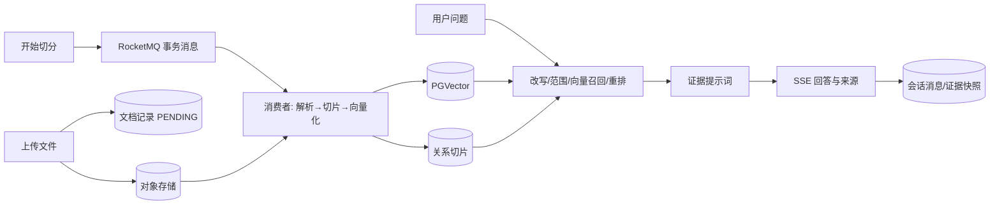

# 第一组：项目主线与简历贡献参考答案

本文件对应 [问题清单](00-questions.md) 的 Q001—Q040。口述中的“我”只表示候选人的表达方式；个人归属仍应以真实分工为准。仓库能够证明的是当前分支的实现、配置与历史记录，不能自动证明某个人独立完成了全部上游能力。文中的历史数字均为静态核对，本轮未重跑模型或实验。

### Q001｜P0｜请用两分钟介绍这个项目，以及它解决的具体问题。

**参考回答：**这个项目把分散的工业文件先处理成可检索、可回查来源的片段，再用这些片段回答用户问题。上传的 XLSX、PDF 等文件要经过解析、切分和向量化，向量存进 PostgreSQL 的 PGVector 表；用户提问时，程序先整理问题，再召回相关片段、重排候选，选出本次请求使用的证据，最后让模型生成回答并通过 SSE 逐步返回。对表格，片段还保留工作表和单元格范围，便于核对型号、阈值和适用工况；其他格式则保留解析器实际取得的来源信息。这条链解决的是查找和定位依据费时的问题，不能单凭链路存在就保证答案正确。

**追问①：** 举一个检测流程表格查询的真实业务类型，说明原先怎样查、现在怎样查。

**追问①回答：**比如问“中心实验室测矿浆浓度时温度和公式是什么”，原先需要打开资料，找到中心实验室对应的那一行，再核对 `105±5 ℃` 和计算式。现在用户输入问题后，系统从已入库的片段里找相应场景，把命中的内容交给模型生成回答，并给出文档版本与单元格位置供人复核。节省的是定位时间，数值仍要以原表为准。

**追问②：** 原型的使用范围、交付状态和你能证明的效果分别是什么？

**追问②回答：**它目前是可复现的工程原型：文档摄取、基于证据的问答、证据草案和模拟链路已有实现。固定数据与配置下的分块和检索记录能说明局部行为；登录页面的完整业务验收、对象级访问权限和真实设备控制没有得到相同级别的证明，所以不能把这些局部结果说成生产收益或整体答案准确率。

**反查：**[仓库项目定位](../../../README.md)、[项目能力边界](../README.md)、[浓度检测脱敏示例](../samples/concentration-process.md)

### Q002｜P0｜基于开源 Ragent 开发，你本人完成了哪些工作？

**参考回答：**我会先说明哪些是开源基础，再讲自己参与的分支改动。Spring Boot 后端、基础摄取、模型适配、PGVector 检索、问题改写、意图路由和流式聊天来自上游。围绕简历，我重点参与了三处：处理 XLSX 合并单元格和宽表，让切片保留列名与值的对应关系；在已有召回和重排流程中，把文档名及结构化表格文本交给重排模型，并做公开集对照；把原先每道子问题各取最多十块改为整次请求共用十块的额度。跨题重复后的补位功能虽已实现，主配置仍关闭。版本、任务和停止链路的其他改动，个人归属还应按真实分工说。

**追问①：** 哪些能力是上游已有，哪些是你修改或新增？

**追问①回答：**PGVector 存储、重排接口和多通道检索框架已经在上游，我改的是它们如何处理这批业务数据。例如，XLSX 解析时区分真实重复行与合并区产生的空续行；分块时同时检查展示表格和向量文本；检索时让重排读取“文档名＋列名和值”，并把最终块数按整个请求分配。模型返回是否需要拆题的 `should_split` 标记也由后端校验，不能把这些说成从零实现向量数据库。

**追问②：** 任选一个改动，用问题、定位、方案、验证四步讲清，并指出证据入口。

**追问②回答：**以 XLSX 为例，目标文件曾出现 12,489 字符的大块和处理链额外制造的重复。我沿着合并单元格展开、表格切片、后续打包逐段定位：空续行被复制成相同行，长度只检查一种文本，已拆片段又可能合回去。改动后只折叠确由展开产生的续行，按实际渲染长度拆行或拆列，并阻止拆片被回并。回归用例、同一工作簿离线审计和历史重入库记录显示最大正文为 1,019、额外精确重复为 0；这是块结构结果，不是答案准确率。

**反查：**[仓库工程能力表](../../../README.md)、[XLSX 改动记录](../changes/2026-08-13-xlsx-structure-aware-chunking.md)、[请求级检索改动](../changes/2026-08-13-request-level-retrieval-purity.md)

### Q003｜P0｜请画出从文件进入系统到用户拿到答案的主链。

**参考回答：**先由用户上传文件：接口保存原文件并登记文档，上传完成时还没有可检索的向量。用户再点击开始切分，接口发送事务消息；消息提交后，RocketMQ 消费者从对象存储取文件，解析、切块、生成向量，并在新结果准备好后替换旧索引。用户发起聊天时，另一条在线流程才整理问题、计算检索范围、召回并重排候选，把选出的证据交给模型；回答经 SSE 逐段返回，相关消息与证据快照随后保存。两条流程的触发者和完成时点不同。

**追问①：** 哪些步骤同步执行，哪些通过 RocketMQ 或线程池执行？

**追问①回答：**上传和点击开始切分先经过同步 HTTP 接口，接口响应只能说明各自入口已处理；真正解析、向量化和写索引由收到已提交消息的消费者异步完成。聊天接口建立 SSE 连接后，编排进入聊天执行器；多道子问题及启用的检索通道可在线程池并发，结果按原子问题顺序汇合，模型输出由专用线程读取。这里有多个异步边界，不能把连接建立当成完整答案已产生。

**追问②：** 原文件、文档记录、切片、向量和聊天消息分别存在哪里？

**追问②回答：**原文件放在私有对象存储；PostgreSQL 保存文档状态、关系切片、会话和消息，同一数据库的 PGVector 表保存 1536 维向量。Redis 承担缓存、排队及短期取消标记，RocketMQ 负责传递摄取事件。代码还支持可选的 ES 和图索引，但主配置没有启用，不能把它们算进默认链路。

**反查：**[文档生命周期](../flow-notes/02-document-lifecycle.md)、[文档到证据](../flow-notes/03-document-to-evidence.md)、[聊天流与停止](../flow-notes/06-chat-stream-and-cancel.md)

### Q004｜P0｜为什么工业资料适合做检索增强生成，而不直接把全部文档交给模型？

**参考回答：**工业问题通常要找的是特定版本、设备和工况下的具体条款，所以我先检索相关片段，再让模型基于这些片段回答。若把所有资料直接放进请求，材料会挤占模型窗口，相似型号、旧版规定和重复表头也会相互干扰。入库时保留文档名、版本及可取得的位置，检索时只选少量候选，回答后还能回到原文核对。这样缩小了模型需要判断的范围，但仍需验证模型是否正确理解证据。

**追问①：** 型号、阈值、否定条件和文档版本带来哪些特殊困难？

**追问①回答：**例如 `C1` 与 `C11` 在语义上很近，却可能是两台设备；`105±5 ℃` 的符号不能丢；“不得”如果落在切片外，结论会反转。处理时要让型号、条件、数值和否定词尽量一起进入候选，并保留版本信息。即便召回两个版本，程序也不能只因较新编号就自行认定哪份在业务上有效，冲突仍需按原文和业务规则确认。

**追问②：** 哪些问题更适合数据库查询或人工确认？

**追问②回答：**实时库存、精确汇总和当前审批状态应查业务数据库或受控工具，因为文档索引不是这些状态的实时事实源。涉及安全联锁、异常处置或真实设备动作，回答可以提供文件依据，但执行前仍需人工和业务审批。这里的检索问答主要承担查依据与解释的工作。

**反查：**[检索与上下文](../flow-notes/05-retrieval-and-context.md)、[证据任务边界](../flow-notes/08-evidence-task-and-version.md)、[浓度检测示例](../samples/concentration-process.md)

### Q005｜P0｜用户上传文件成功后，这份文件是否立即可检索？

**参考回答：**不会。上传接口先把原文件写入对象存储并登记文档，此时状态是待处理（`PENDING`），意思是文件已登记、还没开始解析，也没有关系切片和向量。用户另点“开始切分”后，本地事务尝试把文档改为处理中（`RUNNING`）并提交事务消息；消费者收到消息才读取文件、解析、切分、向量化并写索引。消费者完成后会写处理成功（`SUCCESS`）和块数，失败则尝试写处理失败（`FAILED`）。接口响应和后台完成是两回事，实际可检索性还要核对索引。

**追问①：** 登记、开始切分、消费执行分别由什么请求或事件触发？

**追问①回答：**上传由 `POST /knowledge-base/{kb-id}/docs/upload` 触发，负责保存文件与登记记录；点击开始切分调用 `POST /knowledge-base/docs/{doc-id}/chunk`，负责尝试占用该文档的处理状态并发送事务消息。只有消息提交后，消费者才调用 `executeChunk(docId)` 处理文件。三个环节由不同请求或事件触发，不能把上传请求说成自动完成切分。

**追问②：** 前端收到成功响应时，怎样确认究竟完成了哪一步？

**追问②回答：**上传接口返回文档对象时，前端可确认“已登记、待处理”，不能显示“已入库可问答”。开始切分接口当前只给普通成功响应，没有任务句柄，也不保证后台已做完；前端需要继续查文档状态和摄取日志。看到成功状态及块数，才能确认消费者报告完成；若显示失败，应展示错误并允许再次发起。状态与索引异常错位时还需查实际数据。

**反查：**[文档生命周期第 2—4 节](../flow-notes/02-document-lifecycle.md)、[KnowledgeDocumentController.java](../../../bootstrap/src/main/java/com/nageoffer/ai/ragent/knowledge/controller/KnowledgeDocumentController.java)、[KnowledgeDocumentServiceImpl.java](../../../bootstrap/src/main/java/com/nageoffer/ai/ragent/knowledge/service/impl/KnowledgeDocumentServiceImpl.java)

### Q006｜P0｜文档摄取有哪些状态，重复点击开始切分会发生什么？

**参考回答：**文件上传后是待处理（`PENDING`）；用户点击开始切分时，本地事务用带条件的 SQL 把尚未处于处理中的文档改成处理中（`RUNNING`），这个状态表示已取得本轮处理资格，不能据此认定解析已经启动。消费者写完索引后改为处理成功（`SUCCESS`）并记录块数；主体发生业务异常时尝试改为处理失败（`FAILED`）。两次点击并发时，先更新成功的一次取得资格，后一次更新零行、对应事务消息回滚；但当前发送适配层仍可能给第二次请求返回 HTTP 成功，因此页面不能据此判定新任务已发布。

**追问①：** 为什么用带状态条件的 UPDATE，而不只在 Java 中先查后改？

**追问①回答：**如果先用 Java 查询，再更新状态，两个并发请求可能都读到“尚未处理”，随后都发消息。这里用 `UPDATE ... WHERE id=? AND status<>RUNNING` 在数据库一条语句中完成条件判断和状态修改；只有受影响行数为 1 的请求才取得处理资格，另一请求看到 0 行就不能启动该轮。这是防止并发重复发起的原因。

**追问②：** 影响行数为零、事务消息回滚与 HTTP 返回成功可能怎样组合？

**追问②回答：**第二次点击更新零行后，本地回调抛出“正在进行中”，事务回滚，尚未正式提交给消费者的消息也应回滚。但监听器把异常变成消息回滚结果后，发送适配器没有再把这个结果作为 HTTP 错误抛出，于是可能出现“第二条消息没提交、第二个接口却返回成功”。这正是前端要继续查状态和日志的原因。

**反查：**[文档生命周期第 3 节](../flow-notes/02-document-lifecycle.md)、[KnowledgeDocumentServiceImpl.java](../../../bootstrap/src/main/java/com/nageoffer/ai/ragent/knowledge/service/impl/KnowledgeDocumentServiceImpl.java)

### Q007｜P0｜RocketMQ 事务消息在这个项目里保证什么？

**参考回答：**事务消息把“数据库已接受一次开始切分”与“消费者能看到任务”联系起来。RocketMQ 先保存消费者暂时看不到的半消息；本地事务再条件更新文档为处理中（`RUNNING`，表示本轮已获执行资格）并写调度信息。事务提交才允许消息正式投递，事务失败则回滚消息。消费者之后的解析、模型调用和索引写入不在这次事务里，消息也可能重复投递，所以它不保证一次且仅一次摄取。

**追问①：** 半消息、本地状态事务和 Broker 回查如何衔接？

**追问①回答：**Broker 先收半消息，发送端执行本地状态事务，再把提交或回滚结果通知 Broker。若第二阶段结果丢失，Broker 会回查；当前回查只看文档是否仍处于处理中（`RUNNING`），是就提交消息，其他状态则回滚，查询出错则返回 `UNKNOWN` 等待后续回查。这个判断说明当前文档状态，不能证明被回查的那条消息已经完成消费。

**追问②：** 仅检查文档当前为 RUNNING，为什么不能证明某条执行恰好一次？

**追问②回答：**当前回查没有核对消息 ID 或执行代次。假如旧消息等待回查时文档已结束上一轮、新一轮又把状态改为 `RUNNING`，回查会把新一轮状态误当旧消息的提交依据。再加上 MQ 可能重复投递，消费者也没有按消息键登记“这一轮已执行”，同一文件可能再次解析、调用向量模型和替换索引。因此只能说本地状态与消息提交有关联，不能说摄取恰好执行一次。

#### 深挖追问 Q007-D01

**评审依据：**追问②指出缺少执行代次会混淆任务，但没有展开旧消息与新一轮 RUNNING 相遇的时序。

**问题：**假设同一文档上一轮消息的回查延迟到下一轮 RUNNING 才到达，请按时间顺序说明仅查状态会怎样误判。如果设计执行代次，应让哪些更新同时校验它，才能防止旧任务覆盖新结果？请明确这是改进设计。

**深挖回答：**问题出在回查只看文档“现在是否处理中”，没有确认“是不是被回查的那一轮”。设第一轮为 G1：Broker 已收到半消息，本地事务曾把文档改为处理中（`RUNNING`），但 Broker 没收到明确的提交结果，于是延后回查。G1 后来因业务失败或人工恢复离开这个状态。用户接着发起 G2，文档又被改成 `RUNNING`。此时 G1 的回查只读到同一个状态值，误以为 G1 的本地事务仍有效，便提交旧消息。若 G1 和 G2 都被消费，结束较晚的旧任务还可能把较新的索引、处理结果和日志覆盖。状态相同只说明“有一轮在处理”，不说明是哪一轮。

下面是改进设计，当前代码还没有这项保证。每次发起生成不可复用的 `generationId`，同时写进消息和数据库任务记录。本地事务应在同一次条件更新中确认文档允许启动、写入当前代次、登记该代任务及调度信息；Broker 回查必须按文档和消息里的代次查询那一轮的事务结果，不能拿 G2 的状态回答 G1。消费者再按代次做唯一登记和条件认领，使同一代消息重复投递时只有一个执行者能取得处理权。

解析和向量计算耗时，可以在短事务外完成；准备好 G2 的新结果后，发布事务仍须校验文档当前代次是 G2，才切换或替换索引、写成功状态和结束日志。失败补偿也带 G2 条件。若检查时已进入 G3，G2 的索引、状态和日志都不得发布。相关数据库写入应在同一事务内完成，避免旧任务只覆盖其中一部分。这能阻止旧代覆盖新代并处理重复投递；对象存储、模型调用与 MQ 仍不是一个跨系统的恰好一次事务。

**反查：**[事务消息与回查](../flow-notes/02-document-lifecycle.md#3-单独点击开始切分事务消息只交接执行权)、[KnowledgeDocumentChunkConsumer.java](../../../bootstrap/src/main/java/com/nageoffer/ai/ragent/knowledge/mq/KnowledgeDocumentChunkConsumer.java)

### Q008｜P0｜解析失败后，消息队列一定会自动重试吗？

**参考回答：**解析失败通常不会自动让 RocketMQ 重投。消费者进入主体处理后，`runChunkTask` 会捕获解析、切片、向量化和索引写入抛出的异常，尝试把文档改成处理失败（`FAILED`）并记录日志，然后正常返回；队列看到的就是这次消费结束。要再处理，一般由用户重新点击开始切分，或由适用的远程调度触发。若异常发生在主体捕获范围外，或者写失败状态时再次抛错，才可能越过消费者边界并进入 MQ 的失败重投路径。

**追问①：** 业务捕获异常并写 FAILED 后正常返回，对消费者意味着什么？

**追问①回答：**业务代码把异常写成 `FAILED` 后正常返回，消费者方法就没有把错误交给 MQ，因此原始解析错误不会因为“文档失败”而自动重试。主体 `try` 之前还有配置恢复、知识库查询和初始日志插入；这些地方若抛错，异常可直接传播给消费者，队列会按自己的失败策略处理。要判断是否重投，应看异常最终是否越过消费方法。

**追问②：** 失败状态落库再次出错时，如何避免二次异常掩盖原问题？

**追问②回答：**当前实现中，若写失败状态或更新日志又抛异常，这个第二次异常可能越过消费者，使 MQ 重投，也可能掩盖最早的解析错误。改进时应保留原异常作为主因，把状态更新、日志记录分别保护，并用对账处理遗留的处理中状态。这是待补的补偿设计，不能说现有代码已经具备。

**反查：**[消费者失败边界](../flow-notes/02-document-lifecycle.md#4-消费者执行恢复操作者调用固定摄取内核再记录终态)、[KnowledgeDocumentServiceImpl.java](../../../bootstrap/src/main/java/com/nageoffer/ai/ragent/knowledge/service/impl/KnowledgeDocumentServiceImpl.java)

### Q009｜P0｜重新摄取时，为什么先完成解析和向量化，再替换旧索引？

**参考回答：**重摄取时先把新内容准备好，再替换旧索引，是为了避免解析或模型调用失败后原本可查的资料被提前删掉。消费者先取得文件、解析并生成完整新切片，随后批量调用向量模型；数量、空值和维度检查通过后，写入器才在同一个 PostgreSQL 本地事务里删除或停用旧块并插入新块与向量。写入中抛错可回滚数据库这部分修改；模型调用和对象存储不在事务内。索引提交后才由外层更新文档成功状态，所以索引与状态仍可能异常错位。

**追问①：** 关系切片表与 PGVector 表为什么可以一起回滚？

**追问①回答：**关系切片和 PGVector 向量都在默认 PostgreSQL 数据源中。写入器用同一数据库事务处理旧关系块逻辑删除、新关系块插入、旧向量物理删除和新向量插入；任一数据库操作抛错，事务可把这些修改一起回滚。解析和调用向量模型已经在此之前完成，不能随这个数据库事务回滚。

**追问②：** 索引已提交但 SUCCESS 状态写失败，会留下什么现象？

**追问②回答：**索引事务先提交，外层随后才写处理成功（`SUCCESS`）及摄取日志。如果这一步失败，失败处理还可能把文档记为 `FAILED`，而新向量已经能被检索，页面状态与实际索引便不一致。可选 ES 的同步也只是提交后的尽力操作；要判断实际情况应核对索引与日志，不能只凭文档状态推断各存储都一致。

**反查：**[文档到证据第 5 节](../flow-notes/03-document-to-evidence.md#5-写入器依次替换关系块和向量提交后才把结果交回-b)、[ChunkIndexWriter.java](../../../bootstrap/src/main/java/com/nageoffer/ai/ragent/core/ingest/sink/ChunkIndexWriter.java)、[RelationalChunkSink.java](../../../bootstrap/src/main/java/com/nageoffer/ai/ragent/knowledge/sink/RelationalChunkSink.java)

### Q010｜P1｜PDF、扫描 PDF 和 XLSX 分别怎样选择解析器？

**参考回答：**正式摄取时，程序用文件真实字节和文件名探测 MIME，再按所选解析档及注册表匹配解析器：先找所选档的精确 MIME，再找该档通配匹配，找不到才依次回退默认快速档的精确和通配匹配。`FAST` 是默认快速档，`FIDELITY` 是请求的高保真档，但只有注册了对应实现才会改变解析器。PDF、Word、PPT 即便选择高保真档，当前也会回退到快速档的 MinerU；XLS/XLSX 在快速档用 POI，标准表格 MIME 在高保真档可由 MinerU 处理，通用 Office 别名则可能回退 POI。

**追问①：** 扩展名、真实 MIME 和解析档位各起什么作用？

**追问①回答：**扩展名只辅助识别文件类型，最终选择看真实字节探测出的 MIME、用户请求的解析档以及注册表中是否有匹配实现。上传阶段会先检查能否处理该 MIME，正式消费时还会重新按文件字节探测。`FIDELITY` 不等于必定开启 OCR 或使用另一套解析器；没有高保真实现时仍按回退顺序处理。

**追问②：** OCR 开关与 PDF 文字层提取是什么关系，外部解析成功是否就有有效切片？

**追问②回答：**MinerU 的强制 OCR 由单独开关控制，主配置是关闭的；这不会关闭原生 PDF 文字层的解析。扫描 PDF 能否提取文字取决于 MinerU 实际输出，不能按文件类型直接保证。外部解析任务即使返回成功，结果包里仍可能没有有效 Markdown；摄取内核还要检查分块非空和向量结果，失败时不会因此产生有效索引。

**反查：**[文档解析流程](../flow-notes/03-document-to-evidence.md)、[ParserRegistry.java](../../../bootstrap/src/main/java/com/nageoffer/ai/ragent/core/parser/registry/ParserRegistry.java)、[ExcelDocumentParser.java](../../../bootstrap/src/main/java/com/nageoffer/ai/ragent/core/parser/excel/ExcelDocumentParser.java)

### Q011｜P0｜合并单元格展开为什么会制造重复内容？

**参考回答：**合并单元格在原 XLSX 中通常只有左上角存值，其他格是空的。如果解析时把这个值复制到整个区域，横向合并的长说明会在多个列名下重复，纵向合并还会把原本空的下一行变成一条相同行。后续切片和向量化于是反复处理同一段话，既拉长块，也可能把处理链制造的重复误当成多条业务事实。归一化必须区别表头和数据区，还要记住哪些源行本来有值。

**追问①：** 表头合并与数据区合并为什么采用不同展开方式？

**追问①回答：**合并表头要展开，例如上层“检测条件”横跨温度和湿度两列，两个子列都需要带上这个父标题，读者和模型才能知道列的含义。数据区的横向合并则只在第一列保留一次说明，避免一个值被算作多个字段；纵向共享分类遇到下一行确有其他业务值时，仍需把该分类带到那一行。程序按区域所在位置和源行内容区分处理。

**追问②：** 不做这个区分，长说明会怎样影响切片数量和向量表示？

**追问②回答：**若把数据区长说明复制进多个格，Markdown 展示表和“列名: 值”的向量文本都会反复出现同一句话，块可能被撑大，重复块也会增加。历史目标文件曾出现最大 12,489 字符块，但这个数属于那份文件的观测，不能说每次合并都会这样。增加检索候选数量只会让这些重复继续进入后续处理，根因仍在输入结构。

**反查：**[XLSX 根因与方案](../changes/2026-08-13-xlsx-structure-aware-chunking.md)、[ExcelTableNormalizer.java](../../../bootstrap/src/main/java/com/nageoffer/ai/ragent/core/parser/excel/ExcelTableNormalizer.java)

### Q012｜P0｜你怎样区分处理链制造的重复续行和业务原本录入的两条相同记录？

**参考回答：**我会在展开合并单元格之前记下每一原始行是否真有单元格值。归一化以后，只有某行原本全空、展开后又与上一条规范化行完全相同，程序才把它视为展开产生的续行并折叠；两行若原本都有人录入的值，即使文本一模一样，也各自保留。这比对最终字符串一律去重更能保护真实记录。

**追问①：** 为什么必须在展开合并区域之前保存源行是否有值？

**追问①回答：**展开之前的标记是必要的，因为原来空的格一旦被复制了合并值，事后看它也像“有内容”，无法再区分是真实录入还是程序补出的值。程序先保存源行是否有值，再比较展开和投影后的规范化结果；两项条件都满足才折叠，不需要凭文本相似度猜测业务含义。

**追问②：** 如果直接对所有规范化行做字符串去重，会丢失什么？

**追问②回答：**如果只看规范化字符串，两个批次恰好记录同样的检测结果，也可能被删成一条，原表的行数和事实就变了。当前只移除“源行原本全空且由合并展开造成的相同续行”，不对所有内容做全局去重；即便两条记录文字相同，也不能仅凭哈希断定它们是一件事。

**反查：**[文档到证据的贯穿示例](../flow-notes/03-document-to-evidence.md#二贯穿示例一张小表怎样走到一条带向量记录)、[ExcelTableNormalizer.java](../../../bootstrap/src/main/java/com/nageoffer/ai/ragent/core/parser/excel/ExcelTableNormalizer.java)

### Q013｜P0｜现场推演：原始第 2、3 行内容相同且都有值，第 4—5 行是一个合并区域，第 5 行原本全空且展开后两行完全相同，最终保留几条业务行？

**参考回答：**最后是 **3 条**。第 2、3 行虽然内容相同，但两行在原表中都有真实值，所以分别保留。第 4—5 行展开后会得到两条相同的规范化行；第 5 行原本全空，才满足处理链续行的折叠条件，它并入第 4 行，不再算独立业务行。因此 `2 条真实重复 + 1 条合并区业务行 = 3 条`。

**追问①：** 如果第 5 行原本也有独立内容，规则怎样变化？

**追问①回答：**如果第 5 行原本有独立值，它就不符合“源行原本全空”的折叠条件。第 4、5 行应作为两条业务行保留，即使归一化后文字偶然相同也不做全局去重；再加上第 2、3 行，合计是 4 条。

**追问②：** 折叠续行后，单元格来源范围如何保留？

**追问②回答：**折叠改变的是规范化业务行数量，来源坐标仍要覆盖被吸收的原始行。程序把第 5 行范围并入第 4 行，例如从 `A4:D4` 扩成 `A4:D5`，后续块的 `cell_range` 才能带人回原表查看完整合并区域。这个范围用于定位原文，并不表示每个列切片都含有该范围内全部字段。

**反查：**[表格手算示例](../flow-notes/03-document-to-evidence.md#二贯穿示例一张小表怎样走到一条带向量记录)、[XLSX 回归说明](../changes/2026-08-13-xlsx-structure-aware-chunking.md)

### Q014｜P0｜为什么切片同时保存展示正文和用于向量化的文本？

**参考回答：**同一切片保存两种正文，是因为展示和检索要解决不同问题。给人看、也用于最终回答证据的 `content` 保留 Markdown 表格和原顺序；送去生成向量的 `embedding_text` 将一行写成“列名: 值”，并带上必要的工作表或章节路径，让模型不用猜某个值对应哪列。召回以后，重排阶段还会临时把文档名加进排序文本 `rankingText`，帮助比较相似资料；它不覆盖原始展示正文。

**追问①：** 用一行“设备、传感器、正常范围”分别写出 Markdown 表格和键值文本。

**追问①回答：**假设表头是“设备、传感器、正常范围”，数据为“C1、S7、18%～22%”。展示正文保留 `| 设备 | 传感器 | 正常范围 |` 和 `| C1 | S7 | 18%～22% |`；生成向量时用 `设备: C1; 传感器: S7; 正常范围: 18%～22%`。这样两种文本表达同一来源，既能让人读表，也能让检索模型直接看到列值关系。

**追问②：** 重排使用的第三份文本怎样加入文档名，为什么不直接覆盖原文？

**追问②回答：**重排候选时可临时组成 `浓度检测台账 V3\n设备: C1; 传感器: S7; 正常范围: 18%～22%`，让模型同时看到文档身份和行内容。若把这段系统加工的文本写回 `content`，回答引用和预览会像在展示原文，且原有表格形状消失。排序文本只服务重排，来源展示仍用原展示正文。

**反查：**[三份文本契约](../flow-notes/05-retrieval-and-context.md#三当前向量通道怎样从问题查到-pgvector-块)、[MetadataEnrichmentPostProcessor.java](../../../bootstrap/src/main/java/com/nageoffer/ai/ragent/rag/core/retrieval/postprocessor/MetadataEnrichmentPostProcessor.java)

### Q015｜P0｜表格分块为什么同时检查两份文本的长度？

**参考回答：**表格切片要同时检查最终展示表和向量文本的长度，因为两者的额外内容不同。程序按原行顺序尝试加入下一行，先实际渲染包含表头的 Markdown 候选表，再计算带工作表或章节路径的“列名: 值”文本；两份都没有超过 `maxChars`、行数也没超过限制，才留在当前块。若只有当前块放不下，就结束当前块、从下一块继续；若一整行单独也超限，则转入按列拆片。这里控制的是表格草稿形态，不是最终模型输入 token。

**追问①：** 表头、分隔符、章节路径和转义字符是否占预算？

**追问①回答：**展示侧计算完整表头、分隔行、转义后的单元格、列间符号和换行；向量侧计算工作表或章节路径、列名、冒号、分隔符及换行。漏掉这些开销就会在真正渲染后超出目标。后续打包仍可能把满足自身规则的前导文字带入，因此表格草稿的检查不能被说成全链绝对上限。

**追问②：** `maxChars=1024` 与 token 上限有什么区别？

**追问②回答：**`maxChars=1024` 在分块代码里按 Java `String.length()` 计算 UTF-16 代码单元，不是模型 tokenizer 的词元数。历史审计脚本的 Python `len()` 又是 Unicode 码点口径。即使某块恰好小于 1,024，最终请求还会加上系统提示、历史和输出预留，不能据此保证不超过模型窗口。

**反查：**[双文本预算说明](../changes/2026-08-13-xlsx-structure-aware-chunking.md#2-在表格分块层同时约束两份表格草稿文本)、[TableChunker.java](../../../bootstrap/src/main/java/com/nageoffer/ai/ragent/core/chunk/blockaware/TableChunker.java)

### Q016｜P0｜一整行超过预算时怎样拆，单个字段自己就超过预算又怎么办？

**参考回答：**一整行放不进当前表格块时，程序先排除空列，再按原列顺序逐列尝试加入当前列片；加入后两种渲染文本都未超过目标长度，就保留，否则先结束当前列片，让这一列进入下一片。每片重新带上对应表头，因此列名和它的值不会被字符截断拆开。单个完整“列名＋值”本身若已超过 1,024，当前实现宁可保留这个完整字段并允许该片超目标，也不静默截断条款。多个列片保存同一原始行来源范围，但后片不一定包含前片的设备字段。

**追问①：** 按列切片怎样保留键和值的关系？

**追问①回答：**例如一行有“设备=C1、要求=长说明、备注=长说明”，程序从设备列开始逐列试装；若再放备注会超长，就把备注放到下一片。每片都同步选取相同列集合的表头和值，所以不会出现“要求”表头配“备注”内容。第二片只有备注时，来源范围仍可定位原行，但模型只看到第二片正文时未必知道它属于 C1，不能把来源位置当作自动补齐整行语义。

**追问②：** 为什么“目标文件最大 1019 字符”不能推出所有输入必定小于 1024？

**追问②回答：**1,019 是历史目标工作簿最终正文的最大观测值，只能说明那份文件在当时的切分和打包后没有留下更长块。换一份表，如果单个字段就超 1,024，当前规则会完整保留它；非表格原子段落也可能超出目标。因此这是固定输入的测量结果，不是任意输入的硬保证。

#### 深挖追问 Q016-D01

**评审依据：**追问①的第二个列片只含备注，尚未解释设备标识与备注拆开后怎样理解其业务归属。

**问题：**沿用“设备=C1、要求、备注”的例子，如果召回只命中了备注列片，同一来源行信息能否直接让生成模型知道设备是 C1？请区分定位原文与入模语义，并说明若要改善这一缺口，会如何取舍重复携带行标识与块长预算。

**深挖回答：**不能直接知道设备是 C1。当前保存的 `cell_range` 说明这个列片来自原表的哪一行，方便系统或人工回去查；它不会自动把该行其他列放进模型输入。若这次只召回“备注：停机后复检”，而设备 C1 在另一列片，模型仅凭备注和来源坐标无法确定设备归属。只有实际给模型的文本包含设备字段，或检索后明确补入同一行的关联片，才有这层依据。

一种待实现的办法是先指定少量真正用于识别业务行的列，例如设备和型号，再把它们作为每个列片的短前缀：`[设备:C1；源行:17] 备注:停机后复检`。分块时先计算前缀长度，再用剩余空间逐列装入其他字段；向量文本和最终证据文本都带此前缀，来源范围仍供回表定位。如果目标是 1,024 个 Java 字符而前缀占 24 个，正文目标就只剩约 1,000 个。这样备注单独命中时才会带上最小业务主语。

重复前缀会增加每片长度与入模 token，也可能让型号在向量中被重复强调，所以不能无条件复制整行。另一种设计是在召回后按源行补公共上下文，但它同样要占最终模型输入空间。若必需标识与不可拆字段合起来已超限，就应明确接受原子超限、做有依据的专项摘要或缩小问题，不能截掉型号与否定条件。上述方案需要实现和验证，不能从现有来源范围推断已经支持。

**反查：**[三个预算分支](../flow-notes/03-document-to-evidence.md#三个预算分支怎样发生)、[TableChunker.java](../../../bootstrap/src/main/java/com/nageoffer/ai/ragent/core/chunk/blockaware/TableChunker.java)

### Q017｜P1｜表格专用切分之后，为什么还需要打包器和装配器？

**参考回答：**表格切分器先在一张表内部按行或列产生草稿，但整篇文件还可能有标题、段落和图片，所以后续打包器需要按相邻关系、章节边界和长度规则组合这些草稿。等最终块的内容与顺序确定后，装配器再分配块序号和 ID，并补需要的章节前缀。若过早编号，两个草稿合并后身份会失效；若不管已拆片段，打包又可能把超宽表合回长块。

**追问①：** `piece` 标记怎样防止已拆片段又被合并？

**追问①回答：**表格确实拆出多个片段时，草稿上的 `piece=true` 表示“这些是为了控制宽表而有意拆开的片段”。打包器看到它，就逐片处理，不再因为整节短而把它们全部合回；前导语只有与该片合并仍不超过 `maxChars` 才带入。只生成一片的表格没有这个拆片边界。

**追问②：** Sheet 边界、标题前缀和切片 ID 应在哪个阶段确定？

**追问②回答：**打包时先按顶级章节路径分界，对 XLSX 就是不跨工作表拼块；标题草稿再按规则与正文组合。等组合完成，装配器才给最终块分配顺序号和 ID，避免合并后留下两个 ID 或重复标题。重新摄取会产生新的块 ID，来源比对不能依赖旧 ID 不变。

**反查：**[打包与装配流程](../flow-notes/03-document-to-evidence.md#3-分块服务按-block-类型产草稿表格逐行做双文本预算)、[ChunkPacker.java](../../../bootstrap/src/main/java/com/nageoffer/ai/ragent/core/chunk/blockaware/ChunkPacker.java)、[ChunkAssembler.java](../../../bootstrap/src/main/java/com/nageoffer/ai/ragent/core/chunk/model/ChunkAssembler.java)

### Q018｜P0｜“最大长度 12,489→1,019、精确重复 17→0”是怎样测出来的？

**参考回答：**这些数字来自同一目标 XLSX 的历史块结构对照，不是所有表格的通用结果。审计读取最终展示正文 `content`，用 Python `len()` 统计码点长度；对正文做 NFKC 兼容规范化，把几种横线统一为 `-`、全角波浪号统一为 `~`，再去掉空白及 `* # 反引号 _`；规范化结果完全相同的组按 `数量-1` 计额外重复。历史记录里块数由 123 到 79，最长正文由 12,489 到 1,019，超过 1,024 的块由 70 到 0，额外精确重复由 17 到 0。本轮没有重跑该实验。

**追问①：** 指标针对哪个输入、哪份正文、怎样规范化和计重复？

**追问①回答：**输入是固定的本地工作簿，统计对象是最终 `content`，不是向量文本或模型 token。Python 审计长度数的是 Unicode 码点，分块时 Java `String.length()` 数的是 UTF-16 代码单元，不能把二者当成同一指标。重复只按指定规范化后的完全相等分组；原工作簿里真实存在的重复业务行不应因此在摄取阶段删除。

**追问②：** 块数与解析锚点有什么变化，能否由此声称回答准确率提高？

**追问②回答：**历史目标文件的块数从 123 降到 79，抽查的 5 个解析锚点仍为 `5/5`。这说明抽查短语还在，且块形态与额外精确重复按既定口径改善；它没有覆盖每个事实，也没有生成答案。要声称回答准确率变化，还必须另做端到端答案与引用评估。

**反查：**[XLSX 指标口径](../changes/2026-08-13-xlsx-structure-aware-chunking.md#问题如何发现与边界)、[块审计脚本](../../../eval/iron-ore/audit_chunks.py)

### Q019｜P1｜你会怎样验证表格修复没有损坏原有事实？

**参考回答：**我先用小表锁住“不误删”的规则，再用目标工作簿和在线重入库检查真实链路。小表里放两条内容相同但都有人录入的行，要求保留两条；再放合并展开形成的空续行，要求只折叠它并扩大来源范围；宽而稀疏的一行要按列拆且保持列名与值对应；单个超长字段则要完整保留并承认会超目标。随后审计目标文件的长度、重复和锚点，在线重入库再覆盖解析、向量和数据库写入。每层说明不同事实，不能只看块数变少。

**追问①：** 给出真实重复行、合并续行、宽表、超长原子字段四类最小用例。

**追问①回答：**最小用例要分别断言：真实重复行仍有两条；原本空的合并续行只并入上一行且来源范围扩大；宽表拆片按原列顺序，每片表头和值一一对应且不跨工作表；单个超长键值不被截断。还要检查拆片标记使打包器不把它们重新合并。这样才能同时防重复和防误删。

**追问②：** 单元测试、目标工作簿审计和在线重入库各能证明什么？

**追问②回答：**单元测试只证明构造输入触发的规则；固定工作簿审计证明那份文件的块长、重复和抽查锚点；在线重入库才覆盖真实 POI 解析、向量模型、事务写入和数据库落点。历史在线记录也不是本轮新执行。这三层都不能直接证明所有工作簿或最终回答一定正确。

**反查：**[XLSX 验证方法](../changes/2026-08-13-xlsx-structure-aware-chunking.md#验证方法)、[ExcelTableNormalizerTest.java](../../../bootstrap/src/test/java/com/nageoffer/ai/ragent/core/parser/excel/ExcelTableNormalizerTest.java)、[TableChunkerTest.java](../../../bootstrap/src/test/java/com/nageoffer/ai/ragent/core/chunk/TableChunkerTest.java)

### Q020｜P0｜文档版本、工作表和单元格范围怎样一路保留到回答来源？

**参考回答：**上传时先按文件名规则提取文档身份和显式版本，例如末尾的 `V1.2`；它不是从正文推断。解析 XLSX 时，程序给内容附上原文件、工作表和单元格范围。切分、装配及落库沿着同一块 ID 保存这些元数据；检索命中向量后再按块 ID 回查关系块和文档信息，来源组装按文档归并，才把文档名、版本、工作表、范围和代表摘录展示给用户。位置帮助回原表核对，宽行列片当前仍保存整行范围。

**追问①：** 文档版本从文件名还是正文提取，重摄取后切片 ID 是否保持？

**追问①回答：**版本由文件名规则读取，不是模型阅读正文后判断。重摄取会重新装配块并生成新 ID，因此同一来源前后两次摄取的块 ID 不能作为稳定标识；追踪版本和位置应看文档键、版本及来源坐标。

**追问②：** 宽行按列拆开后，来源范围是否精确到各自列片？

**追问②回答：**普通多行块会把首末行合成范围，折叠的空续行也并入该范围。宽行按列拆成多片时，各片目前仍带同一个原始整行 `cell_range`，没有精确缩成各自列范围。它能告诉人回原行查，却不证明片段正文含整行所有字段，也不能声称已精确定位到该列片的每一列。

**反查：**[文档来源链](../flow-notes/03-document-to-evidence.md)、[DocumentIdentityResolver.java](../../../bootstrap/src/main/java/com/nageoffer/ai/ragent/knowledge/support/DocumentIdentityResolver.java)、[SourcesAssembler.java](../../../bootstrap/src/main/java/com/nageoffer/ai/ragent/rag/core/source/SourcesAssembler.java)

### Q021｜P0｜批量向量化怎样确保第 i 个向量对应第 i 个切片？

**参考回答：**批量向量化先按最终切片列表的顺序取出各块的向量文本，组成输入数组；服务返回后，程序按同一下标把第 i 个向量装回第 i 个块。若供应商限制单批数量，客户端把原数组分成连续区间请求，再按原偏移拼回结果。写索引前还要检查返回条数、空值和 1536 维形状。这里依赖供应商保持输入输出顺序；当前实现没有按响应里的下标重新排序，所以条数正确的乱序仍可能静默错配。

**追问①：** 返回数量、空向量和维度分别怎样校验？

**追问①回答：**程序先检查向量列表非空且总数等于切片数，再逐项检查该位置不是空向量，长度也等于当前部署要求的 1536。全部通过才把向量与块配对并进入索引替换，因此形状错误不会先删除旧索引。这些检查只能证明数组形状和数量，不能证明每个向量的语义正确。

**追问②：** 供应商打乱返回顺序但条数正确，当前实现是否能够发现？

**追问②回答：**发现不了。若供应商把第 1、2 个向量调换，却仍返回正确条数和维度，当前按位置配对会把两块的向量接反。若要支持可能乱序的接口，应读取每项返回的 `index`，验证无重复、无缺项、未越界后再按原输入位置重排；这属于改进设计，不是当前保证。

**反查：**[向量对齐流程](../flow-notes/03-document-to-evidence.md#4-指定知识库模型批量编码并按位置把向量装回原-chunk)、[ChunkEmbeddingService.java](../../../bootstrap/src/main/java/com/nageoffer/ai/ragent/core/ingest/embed/ChunkEmbeddingService.java)、[AbstractOpenAIStyleEmbeddingClient.java](../../../infra-ai/src/main/java/com/nageoffer/ai/ragent/infra/embedding/AbstractOpenAIStyleEmbeddingClient.java)

### Q022｜P0｜从一个用户问题开始，当前默认检索链怎样执行？

**参考回答：**用户问题先经过改写和意图处理；对每个子问题，程序据意图计算要检索的知识库集合，然后用默认 Qwen3-Embedding-8B 把问题变成向量，在这些集合的 PGVector 中召回候选。候选去重后限制进入重排的池大小，批量补齐文档名和表格向量文本，再把问题与“文档名＋结构化内容”交给 qwen3-rerank 调整顺序。最后各子问题按整次请求共用的块额度取前缀，形成统一块列表和按问题组织的证据文本。主配置只开启向量通道，不能把可选 BM25 或图检索说成在线默认步骤。

**追问①：** 哪些通道默认开启，代码存在的 BM25、图检索是否都在执行？

**追问①回答：**主配置启用的是 PGVector 向量通道；关键词、图和 Web 通道关闭，`rag.keyword.type=none` 与 `rag.graph.type=none` 就是对应配置。虽然仓库有 Elasticsearch BM25、图检索和多路 RRF 融合代码，默认聊天不会调用它们。只有相关通道实际开启，才需要比较多路候选并计算融合次序。

**追问②：** 召回 20、候选池 40、最终 TopK 10 分别限制哪个列表？

**追问②回答：**默认召回深度 20 是每道子问题、每条启用通道准备候选的额度，定向意图的节点设置还可能覆盖它；候选池 40 是该子问题去重、融合后进入补元数据和重排的上限；最终 TopK 10 才是整个用户请求选出的去重知识块数量上限。三者限制不同阶段的列表，实际候选不足或跨题重复时可以少于这些数。

**反查：**[默认检索链](../flow-notes/05-retrieval-and-context.md)、[application.yaml](../../../bootstrap/src/main/resources/application.yaml)、[MultiChannelRetrievalEngine.java](../../../bootstrap/src/main/java/com/nageoffer/ai/ragent/rag/core/retrieval/MultiChannelRetrievalEngine.java)

### Q023｜P0｜PGVector 怎样计算相关性，为什么使用 HNSW？

**参考回答：**程序把子问题编码并归一化后，在限定的知识库集合中按向量余弦距离检索，SQL 的 `<=>` 算距离，距离越小排得越前；返回给后续流程的相关分用 `1-distance` 表示。PGVector 表上配置的 HNSW 余弦索引把向量组织成可逐层导航的近邻图，查询时通常只走一部分候选，以近似召回换取较低延迟。索引是否被当前 SQL 实际使用，仍需看运行计划，不能只凭建索引语句判断。

**追问①：** 余弦距离和返回的相似度分数是什么关系？

**追问①回答：**余弦距离反映向量方向差异，程序把它换成 `1 - 距离`，所以返回分数越大表示方向越接近。但这一比较要求入库向量和查询向量来自兼容的模型与输入规则；两组数据即使同为 1536 维，若模型空间不同，SQL 仍会算出数字，却不代表语义相关。

**追问②：** 怎样确认 SQL 实际使用了索引和预期搜索参数，而不是只看代码里写了 SET？

**追问②回答：**代码发出 `SET hnsw.ef_search=200` 和 `SET hnsw.iterative_scan=relaxed_order` 还不足以证明搜索实际使用这些参数，因为当前多次 `JdbcTemplate` 调用没有显式事务固定同一物理连接。验证时应在同一连接查看扩展版本与参数，再对有代表性的集合过滤查询执行 `EXPLAIN (ANALYZE, BUFFERS)`，观察计划是否走 HNSW、返回多少候选及耗时。

#### 深挖追问 Q023-D01

**评审依据：**主回答用“多层图”解释 HNSW，但省略了从入口找到候选近邻的具体过程。

**问题：**不用公式，拿一组分布成两簇的点说明层次可导航小世界图（HNSW）怎样从上层入口逐步下探并在底层保留候选；为什么搜索更快却可能漏掉真实最近邻？

**深挖回答：**可以把库里的向量想成左边 A 簇和右边 B 簇，查询向量 q 靠近 B。HNSW 的底层连接较密，上层只保留少量节点及可跨较远区域的边。搜索从上层一个入口 A1 开始，只比较它和邻居；若邻居 B0 更接近 q，就走到 B0，继续在这一层找更近的节点。上层走不动时，程序把当前较近的位置作为下一层的入口，在更密的连接中继续找，直到最底层。

在底层，搜索保留一个有限候选集合并持续查看这些候选的邻居。比如为解释过程，暂时只留四个较近点：每发现更近的点就把它加入，太远的点退出候选；待最有希望的待访问节点也无法改善现有集合，就从保留结果里取前 K 个。“四个”只是例子，不是本项目实测参数。它比逐一比较全表快，是因为沿图只访问一部分节点。

代价是近似搜索可能漏掉真正最近的点：跨簇连接没被走到，或有限候选过早排除通向目标的路径，都可能使搜索停在局部邻居。集合过滤还可能在近似候选形成后剔除部分结果，导致合格数不足；这与没找到最近点是不同原因。扩大搜索候选通常增加访问量和延迟，是否改善该库的召回，要用实际查询计划和精确扫描对照验证，不能由建有 HNSW 索引直接推断。

**反查：**[PGVector 检索细节](../flow-notes/05-retrieval-and-context.md#三当前向量通道怎样从问题查到-pgvector-块)、[PgVectorRetrieverService.java](../../../bootstrap/src/main/java/com/nageoffer/ai/ragent/rag/core/vector/PgVectorRetrieverService.java)、[schema_pg.sql](../../../resources/database/schema_pg.sql)

### Q024｜P0｜为什么向量召回后还要用 qwen3-rerank 重排？

**参考回答：**向量召回先把大量文档缩到有限候选：文件入库时编码片段，提问时编码问题，数据库按向量距离找邻近块。因为两边分别编码，文档向量在生成时看不到当前问题，碰到相似型号、否定条件或表格列关系可能分不细。重排模型在候选池形成后同时读取问题和每个候选的排序文本，再给出相对顺序。把它放在有限池之后能做更细的比较，但它不能补回未被召回的事实。

**追问①：** 向量模型与重排模型分别输入什么、输出什么？

**追问①回答：**向量模型分别接收问题或块的 `embedding_text`，返回定长数字向量；PGVector 用这些向量找近邻并给相似分。重排模型接收当前问题、按确定次序排列的候选 `rankingText` 和要返回的数量，输出候选下标与相关分。它只排序候选，不生成回答；后续给回答模型展示的还是块的可读正文。

**追问②：** 重排能否找回根本没进入候选池的事实？

**追问②回答：**不能。若正确条款在解析时丢失、被知识库范围过滤、向量空间不兼容，或因召回深度不足没进候选池，重排模型根本看不到它。排查时应先找原始块、确认检索范围和召回列表，再看是否是候选排序的问题。

**反查：**[候选处理与重排](../flow-notes/05-retrieval-and-context.md#五候选怎样按实际处理器顺序收敛)、[RerankPostProcessor.java](../../../bootstrap/src/main/java/com/nageoffer/ai/ragent/rag/core/retrieval/postprocessor/RerankPostProcessor.java)

### Q025｜P0｜重排响应只给候选下标和分数，怎样还原为正确切片？

**参考回答：**发送重排请求前，程序先把候选按确定顺序放进数组。模型返回的 `index` 指这个数组的位置；程序检查下标合法后取回原切片，复制它的 ID、正文和来源等完整信息，只把相关分改成重排分，然后按模型返回顺序组成前列候选。这样重排响应即使只含位置和分数，也不会丢失原块身份；返回缺项时还要用原候选顺序补齐。

**追问①：** 下标越界、缺项、返回不足时如何处理？

**追问①回答：**响应元素不是对象、没有下标或下标越界，就跳过该项。合法项不足 `top_n` 时，客户端按重排前顺序补还没出现的候选，直到达到数量或候选用完；后处理器还会把未入模型头部的剩余候选接在尾部。默认最终选择只按各题配额取前缀，尾部主要给可选的回填功能使用。

**追问②：** 重排失败退到 noop 时，哪些功能继续、哪些质量保证不成立？

**追问②回答：**模型路由先尝试 qwen3-rerank，失败可退到 `rerank-noop`，此时只保留原顺序前 `top_n`；若整个后处理器异常，处理链也可能沿用它之前的候选。召回和后续回答仍可继续，但这次候选没有获得模型精排。评测或排障应记录降级，不能把原顺序结果当作重排收益。

**反查：**[重排降级边界](../flow-notes/05-retrieval-and-context.md#五候选怎样按实际处理器顺序收敛)、[BaiLianRerankClient.java](../../../infra-ai/src/main/java/com/nageoffer/ai/ragent/infra/rerank/BaiLianRerankClient.java)、[NoopRerankClient.java](../../../infra-ai/src/main/java/com/nageoffer/ai/ragent/infra/rerank/NoopRerankClient.java)

### Q026｜P0｜SciFact 300 条查询的 Recall@10 87.28%→90.42% 是什么实验？

**参考回答：**这是英文公开论文语料上的隔离检索实验，不是工业问答准确率。历史实验用 BEIR SciFact 的 5,183 篇摘要和 test 集 300 条 claim；资料经项目摄取形成 5,438 个块。每题在同一次服务请求里取得深度为 40 的候选，比较原始向量前 10 块与同一向量候选经 qwen3-rerank 排序后的前 10 块，再把块映射回相关论文评分。平均 Recall@10 从 87.28% 到 90.42%；本轮仅核对历史记录，没有重跑。

**追问①：** 语料、相关性标注、候选深度和对照臂分别是什么？

**追问①回答：**相关性标注 qrels 只供评分脚本查“哪篇论文相关”，不送进检索或重排。对照还包含 BM25、RRF 及重排组合，但 87.28%→90.42% 这一组只比较向量召回与同批向量候选经过重排。各组先按相同块数截取，再映射论文，不能把箭头解释成混合检索收益。

**追问②：** 这是英文论文检索还是工业答案评测，能支持简历里的哪一层结论？

**追问②回答：**输入是英文论文摘要和 claim，输出指标是相关论文是否出现在所选块对应的来源中。索引单位为块，评分再映射到论文，所以也不是官方整篇文档排行榜的原样结果。实验未生成答案，不能推出中文工业问答更准；简历只能据此说固定公开集上候选重排改善了这项检索指标。

**反查：**[混合检索实验记录](../changes/2026-09-05-hybrid-retrieval-comparison.md)、[SciFact 评分脚本](../../../eval/context-selection/beir_hybrid.py)

### Q027｜P0｜现场算指标：某题相关论文为 A、B，前 10 个切片只映射出 A、C、D，其中 A 占了 6 个切片，Recall@10 是多少？

**参考回答：**先取前 10 个切片，再映射到源论文并去重。A 虽出现 6 次，但命中的相关论文仍只有 A 一篇；C、D 不在标准相关集合 `{A,B}` 中，所以分子是 1，分母是 2，`Recall@10 = 1 / 2 = 0.5 = 50%`。这项实验的 K 先约束切片数量，重复切片不会重复贡献论文命中。

**追问①：** 去重后是否继续向后补到 10 篇论文？

**追问①回答：**不会。脚本先截前 10 个切片，映射并去重后即使只剩 `[A,C,D]` 三篇，也不会再看第 11 个切片补到十篇。这里十是切片窗口，不是去重后的论文数量，因此要按这个协议解释分数。

**追问②：** 87.28%→90.42% 提升多少个百分点，为什么不能解释成 300 题答对比例？

**追问②回答：**两个展示值相差 `90.42% - 87.28% = 3.14` 个百分点。脚本对每道查询计算命中的相关论文数除以该题相关论文总数，再对 300 道查询求平均；一道题可有多篇相关论文。实验没有生成回答，所以不能说 300 题中多答对了 3.14%。

**反查：**[SciFact 口径说明](../changes/2026-09-05-hybrid-retrieval-comparison.md#更大公开基准beir-scifact)、[beir_hybrid.py 的 metrics/score](../../../eval/context-selection/beir_hybrid.py)

### Q028｜P0｜为什么没有把 BM25 加 RRF 混合检索设为默认？

**参考回答：**目前不把 BM25 加 RRF 的混合检索设为默认，是因为公开集的结果方向不一致，而混合链还要多维护索引。Hotpot 的 200 题看前十块是否覆盖全部支持句，向量加重排是 93.5%，混合加重排是 92.5%，退化两题、改善零题。SciFact 看论文召回和排序，混合加重排虽达到 91.66%/0.7856，高于向量加重排的 90.42%/0.7786，但逐题 nDCG 改善 11、退化 18、其余 271，且未做显著性检验。现有证据不足以证明切换默认设置有稳定净收益。

**追问①：** SciFact 和 Hotpot 的指标与结果方向有什么差异？

**追问①回答：**Hotpot 的指标要求支持句完整覆盖；SciFact 的指标看相关论文召回与排序，两种百分比回答的问题不同。Hotpot 上混合链退步，SciFact 上平均值小升而逐题方向不稳定。两者又都是英文公开集检索，尚未回答中文工业资料上的问题，因此默认仍保留当前向量加 qwen3-rerank 的路径。

**追问②：** 混合多一路召回的收益，应怎样与复杂度、延迟和索引同步成本比较？

**追问②回答：**开启 BM25 要维护 ES 索引、中文分词和文档版本同步，还增加一次召回、RRF 融合及故障处理。当前 ES 同步在数据库提交后尽力执行，失败没有完整自动补齐保证。应先在代表性中文资料上固定语料和问题，比较质量、延迟、错误率与同步成本；只有收益稳定且关键题不明显退化，才考虑改默认。

#### 深挖追问 Q028-D01

**评审依据：**主回答列出平均指标提升但改善题数少于退化题数，未解释两者为何可以同时成立。

**问题：**请构造一个三道题的排序得分例子，演示“两题退化、一题改善，平均分仍上升”。回到当前结果，为什么只数改善题数或只看平均值都不足以判断默认方案是否值得切换？

**深挖回答：**平均值看变化幅度，改善题数只看方向，所以二者可以相反。设默认方案三题的排序分数为 `0.90、0.80、0.20`，平均 `(0.90+0.80+0.20)/3=0.633`；混合方案为 `0.89、0.79、0.80`，平均 `2.48/3=0.827`。前两题各退步 0.01，第三题进步 0.60，因此按题数是“两退一进”，平均却明显上升。反过来，多题小幅进步也可能被少数关键题大幅退步抵消。

当前 SciFact 的逐题 nDCG 是改善 11、退化 18、其余 271，平均却略升，并不矛盾；它提示增益和损失的幅度分布不同。只看改善题数不知道幅度，只看平均不知道哪些题退化，尤其看不到关键证据是否丢失。应看逐题配对差值、变化集中在哪类题，必要时计算置信区间或重采样；还要同时看召回指标。

是否改默认还要结合另一份 Hotpot 对照：混合链的完整支持句覆盖反而下降。它还增加 ES 索引同步、额外召回、融合与故障处理的成本。应在代表性中文工业集上预先规定主要质量指标、可接受退化和延迟门槛，再做固定条件对照。现有结果只能说明某公开集均值小幅上升、逐题方向不稳定，不能证明默认切换的净收益。

**反查：**[Hybrid 结果与决策](../changes/2026-09-05-hybrid-retrieval-comparison.md)、[评测流程第 6.7 节](../flow-notes/09-evaluation-and-diagnosis.md#67-同一次真实请求里混合检索是否值得成为默认hybrid)

### Q029｜P0｜多子问题为什么会让上下文超过原来配置的 TopK？

**参考回答：**旧代码把 `TopK=10` 交给每道子问题，各题最多取十块后再拼接；两题就可能产生二十个题内位置，配置并没有限制整次请求。现在程序先把十解释为整个请求最终知识块额度，再按子问题数分配整数份额，例如三题为 `[4,3,3]`。每题仍可按原有深度召回并重排候选，只在最后按配额取前缀、跨题去重。因此它控制的是本次请求所选的唯一块数上限，不是最终模型输入 token。

**追问①：** 旧的每题预算与新的请求总预算有什么区别？

**追问①回答：**旧规则对每题单独给十个最终位置，一道题用了十个不影响另一题。新规则让全部子问题共享十个位置，先均分额度、再各自取前缀并对整次请求去重。若两题选中同一块，默认不会自动从尾部补位，所以实际唯一块数可能不到十，但不会因此超过十。

**追问②：** 总预算 10，拆成 3 题和 12 题时怎样分配，零额度题是否完全不执行？

**追问②回答：**十个位置分给三题，整数部分各三，余下一个给第一题，得到 `[4,3,3]`。分给十二题时，前十题各一，后两题额度为零；零额度子问题不做知识库召回，但它的 MCP 工具意图仍可能被处理，所以不能说那两题完全不执行。

**反查：**[请求级预算分配](../flow-notes/05-retrieval-and-context.md#一一次请求怎样把问题变成有限候选)、[RetrievalEngine.java](../../../bootstrap/src/main/java/com/nageoffer/ai/ragent/rag/core/retrieval/RetrievalEngine.java)

### Q030｜P0｜现场推演：两题配额各 5，候选分别是 `[X,A,B,C,D,E]` 和 `[X,F,G,H,I,J]`，默认最终保留多少唯一切片？

**参考回答：**默认回填关闭时，先按每题配额五个截前缀：第一题是 `[X,A,B,C,D]`，第二题是 `[X,F,G,H,I]`。随后整次请求按首次出现去重，第二次 X 被删，留下 `[X,A,B,C,D,F,G,H,I]`，即 `5 + 5 - 1 = 9` 个唯一块。J 虽在第二题候选里，却排第六，截前缀时已经不在本轮选择范围内。

**追问①：** 去重发生在截前缀之前还是之后，为什么不自动补 J？

**追问①回答：**先截各题前五，再跨题去重，因此重复 X 被删后不会自动把第二题第六位 J 拉进来。只有显式打开公平回填，程序才继续查看各题剩余候选、跳过已选块并补唯一项；本例可补 J 到十块。主配置目前关闭这个开关。

**追问②：** 最终唯一切片列表与按子问题拼出的 Prompt 文本，重复表现是否完全一样？

**追问②回答：**统一块列表里 X 只算一次，所以请求级去重结果是九块；来源列表还会按文档归并，保存的证据快照最多八块，数量又不同。按子问题拼出的模型证据文本当前仍可在两道题各渲染一次 X，因此九个唯一块不等于正文只出现九次，更不等于 token 已被限制。

**反查：**[默认 9 块示例](../flow-notes/05-retrieval-and-context.md#示例两个子问题共享一块时为什么默认只留下-9-块)、[RetrievalEngine.java](../../../bootstrap/src/main/java/com/nageoffer/ai/ragent/rag/core/retrieval/RetrievalEngine.java)、[RequestLevelChunkSelector.java](../../../bootstrap/src/main/java/com/nageoffer/ai/ragent/rag/core/retrieval/RequestLevelChunkSelector.java)

### Q031｜P0｜“平均上下文 13.05→6.52、文档召回保持 97.6%”究竟比较了什么？

**参考回答：**这是历史 D0 的冻结索引对照：C-final 与 D0 用同一批 `123+14+4=141` 个块和向量、同一 24 题，只替换请求级检索代码；意图与 OCR 关闭，最终块额度十、每路召回深度二十、候选池四十。24 题中有 21 题带可评分的检索证据，平均每请求唯一上下文块从 13.05 降到 6.52，超过十块的题从 17/21 降到 0/21，文档召回两组都是 97.6%。这说明块数受控；本轮未重跑，也不能据此断定答案更准。

**追问①：** 题量、可评分题分母、固定索引和配置分别是什么？

**追问①回答：**24 题里 21 道可回答或近领域题用于检索评分，另三道不可回答题要在生成层判断是否拒答。固定的是文档块和向量，以尽量把变化集中在检索代码；在线问题改写、查询向量和重排仍调用模型，所以单次延迟或候选波动不能全归因于本地代码改动。

**追问②：** Anchor Recall、Hit@5 是否也保持，为什么文档召回不变仍可能丢关键事实？

**追问②回答：**没有保持。关键锚点召回从 86.5% 降到 84.1%，前五块至少命中一个关键点的比例从 95.2% 降到 90.5%。文档召回 97.6% 只表示正确文档出现，并不保证其中回答所需的阈值、条件或否定词也进入上下文。结论应同时说“块数与杂讯减少”和“关键证据存在损失”。

**反查：**[D0 改动与结果](../changes/2026-08-13-request-level-retrieval-purity.md#d0冻结索引只替换检索代码)、[评测流程第 6.2 节](../flow-notes/09-evaluation-and-diagnosis.md#62-再问请求级预算能否减少噪声d0)

### Q032｜P0｜你实现过公平回填，为什么最后保持关闭？

**参考回答：**回填功能处理的是跨题重复后留下的空位：程序轮流查看各子问题尾部候选，跳过整次请求已选的块，补入新的唯一块。历史 D2 把逐题意图和数据库固定，只切换回填开关，关闭与开启各运行三次；关闭时每次最终 167 块、空 73 位，开启时 240 块、空位为零。机制确实填满了额度，但预先规定的质量门槛没有通过，因此主配置仍是 `false`，默认聊天不执行回填。

**追问①：** 固定子问题回放怎样避免改写波动混入结果？

**追问①回答：**D2 回放固定各题的 `subIntents`，绕过在线改写，让开关两侧处理相同的拆题结果；题集、语料、索引、配置与并发也保持一致。查询向量和重排仍在线调用，所以每侧跑三次并看配对及中位数，不能把这个对照称为完全没有模型波动。

**追问②：** 填满 10 个切片和质量门槛通过为什么是两件事？

**追问②回答：**填满十块只说明程序找到了更多唯一候选，不说明这些尾部候选能支持答案。21 道检索题上，锚点召回中位数从 0.841 到 0.865，但 Hit@5 从 0.905 降到 0.762、上下文精度从 0.254 降到 0.200、路由纯度从 0.915 降到 0.811；目标题恢复为 0/3。新增块带来干扰，故未通过门槛并保持关闭。

**反查：**[D2 决策协议与结果](../flow-notes/09-evaluation-and-diagnosis.md#1-先从一个产品决策开始多子问题去重后不足-topk要不要回填)、[公平回填改动记录](../changes/2026-08-14-request-level-fair-refill.md)

### Q033｜P0｜TopK=10 是否已经保证最终请求不会超过模型上下文窗口？

**参考回答：**不能。`TopK=10` 只管整次请求去重后选中的知识块最多十个，不计算每块 token，也不保证单块长度；表格里无法再拆的单个字段还可能超过 1,024 字符。按子问题组织证据时，同一块也可能在两个问题段重复渲染。模型最终接收的还有系统规则、当前问题、会话历史、工具结果及引用标签，并需预留输出空间。当前没有对完整模型请求做 token 总量门禁。

**追问①：** 历史、系统提示、工具结果、引用标签和输出预留是否也占 token？

**追问①回答：**都要计入实际模型窗口：系统提示、当前问题、送入的历史或摘要、工具结果、证据编号与标签占输入 token，回答还需留输出 token。来源面板和保存的证据快照并非整份直接入模，不能把它们当作已计入或已保护的空间。字符数也不能固定换算成 token，必须按目标模型的 tokenizer 对最终消息计算。

**追问②：** 若要补一个请求级 token 门禁，放在哪里最有效？

**追问②回答：**这是改进设计：在检索选择完成、最终 `ChatRequest` 发给模型之前，先按目标模型 tokenizer 计算系统规则、问题、必要历史及输出预留，再决定还有多少空间给完整证据。按子问题保留关键依据，先去重复和低分补充，再对实际发送的完整 messages 复算。若单条关键事实仍装不下，应缩小问题、拆请求或明确无法回答，不能悄悄截掉条件后继续给确定答案。

#### 深挖追问 Q033-D01

**评审依据：**追问②提出多项预算原则，但未给出各部分相互挤占时的实际裁剪顺序。

**问题：**假设模型总窗口为 8000 个词元，输出预留 2000、系统与问题占 1000、历史占 2500，候选证据占 4000。你会如何分配剩余空间并选择裁剪对象？若两道子问题各只有一条完整关键证据，应怎样避免裁剪后仍装作两题都有依据？

**深挖回答：**这是一个拟新增的 token 门禁例子，当前默认路径还没有实施。先按题设算总账：窗口 8,000，输出预留 2,000，系统规则和当前问题占 1,000，历史与证据只剩 `8000-2000-1000=5000`。原方案历史 2,500 加证据 4,000 共 6,500，超出 1,500。可先检查旧历史中哪些轮次不影响当前指代与用户约束，把可替代部分压到 1,000，题设的简化账本就成了 `1000 历史+4000 证据=5000`。若那 2,500 历史里有不可删的设备或工况条件，不能为了装证据而删掉它；应减少补充证据或请用户缩小问题。

简化账本正好相等也不代表请求能发出。实际消息还含角色包装、证据编号、引用或 XML 标签、工具结果等，需按目标模型 tokenizer 计入并留安全余量。例如额外开销是 300，历史仍为 1,000 时证据上限只剩 3,700；应对最终完整 messages 重算，而非只看选中块数或 Java 字符数。

两道子问题若各有一条完整关键证据，选择器应先识别每条中的设备、数值、条件和否定词，删除重复与低分补充，再分别为两题保留完整依据。若两条合计仍装不下，可进一步压缩不必要历史，或拆成两个独立请求。仍不能容纳时，只回答实际有完整证据入模的子题，说明另一题暂缺可用依据；不能截掉 B 的条件句后仍给 B 一个确定答案。检索曾命中 B，与 B 的完整证据确实进入本次模型输入，是两件必须分别记录的事。

**反查：**[上下文与 Prompt 边界](../flow-notes/06-chat-stream-and-cancel.md#28-选择-system-prompt并按真实角色顺序装入消息)、[请求级预算说明](../flow-notes/05-retrieval-and-context.md#一一次请求怎样把问题变成有限候选)

### Q034｜P1｜问题改写与意图分类各解决什么问题？

**参考回答：**问题改写先处理“用户到底在问什么”：程序结合当前问题和有限会话历史，归一化领域词，消解“这个设备”等指代，必要时拆成可独立检索的子问题；它输出检索问题，不输出答案。意图分类接着判断各子问题更适合查知识库、用工具还是走系统回答，并给出候选分数，供检索范围和后续分支使用。意图只帮忙选择处理路径，不执行检索，也不等于用户访问授权。

**追问①：** 模型返回 `should_split=false` 却给多个子问题时，Java 应如何处理？

**追问①回答：**模型可能一边返回“不拆题”（`should_split=false`），一边给多个 `sub_questions`。后端以“不拆题”判断为准，忽略那个数组，只使用单条 `rewrite`；只有标记为 true，才清理子问题、删除空项并按原顺序去掉完全相同的项，清理后为空仍回退到改写句。这使最终是否拆题不由矛盾的模型输出随意决定。

**追问②：** 改写关闭、模型解析失败和术语映射失败是否走同一回退？

**追问②回答：**改写功能关闭时，程序仍做术语归一化，再按标点拆题，但不借会话历史消解指代。模型调用或 JSON 解析失败时，回退到归一化后的单个问题；术语缓存失败可以再查数据库，而数据库查询异常不在同一个模型回退捕获范围内，可能继续向外抛。三种情况不能合称“都回退原问题”。

**反查：**[查询理解流程](../flow-notes/04-query-understanding-and-routing.md)、[MultiQuestionRewriteService.java](../../../bootstrap/src/main/java/com/nageoffer/ai/ragent/rag/core/rewrite/MultiQuestionRewriteService.java)

### Q035｜P1｜意图树怎样存储、还原，并交给模型分类？

**参考回答：**意图树不是一份嵌套 JSON，而是数据库里一行一个节点，靠 `parent_code` 指向父节点。分类前先查 Redis 缓存；未命中时读出启用且未删除的节点，先建节点表，再把子节点挂到父节点下，缺失父节点的项作为根，并计算完整路径。最后只把叶节点的编号、路径、描述、类型和示例放进一次分类提示词，让模型为当前子问题选候选；返回后 Java 再过滤无效编号与低分项。

**追问①：** 是逐层多次调用模型，还是一次给出全部叶子候选？

**追问①回答：**每个子问题只调用一次标准档模型，把当前树的所有叶节点候选一并提供，而不是从根到叶逐层请求。候选里有 ID、路径、描述、类型、示例，工具类叶节点还可带工具 ID。多道子问题分别分类、可并发运行，外层按原子问题顺序收集结果；会话历史在前面的改写阶段使用，不是直接塞给分类器。

**追问②：** Redis 旧缓存、无效意图 ID 和多个子问题分别怎样影响结果？

**追问②回答：**管理接口修改节点时会清缓存；如果绕过接口直接改数据库，旧树可能在七天 TTL 内继续被读到。模型若返回当前树里不存在的 ID，Java 会丢弃；每题的低于 0.35 分候选也会被过滤并限额。多题再做请求级收集时，若有候选的题数本身超过三，当前每题至少留一个的逻辑仍可能超过目标三，这是现有边界。

**反查：**[意图树恢复与分类](../flow-notes/04-query-understanding-and-routing.md#14-为分类准备意图树redis数据库恢复层级再把叶子平铺给模型)、[DefaultIntentClassifier.java](../../../bootstrap/src/main/java/com/nageoffer/ai/ragent/rag/core/intent/DefaultIntentClassifier.java)

### Q036｜P0｜意图限定的知识库范围，是否等于用户的访问权限？

**参考回答：**不等于。意图限定范围只决定“这道题在哪些知识库集合里找相关块”；用户权限还必须决定“当前用户能读哪些文档和块”。当前向量 SQL 按集合名过滤，没有用户、所有者、租户或 ACL 条件，知识库和文档接口也大多只要求登录，所以路由正确不代表对象访问安全。要用于多租户，应先算出用户获授权的集合与语义范围的交集，再让所有检索通道、来源下载和任务操作都执行同一授权；这是改进设计。

**追问①：** 通用 0.35、范围门槛 0.4、置信门槛 0.6 各管什么？

**追问①回答：**意图解析先把低于 0.35 的普通候选过滤；知识库范围处理只接收分数至少 0.4 的知识库意图作为候选；其中最高可信度要达到 0.6，才按绑定的知识库收窄查询。未达 0.6 或绑定失效时走配置的回退范围。三道门分别管候选保留、范围候选资格和是否真正收窄，均不是权限校验。

**追问②：** 主配置 global 与演示 profile empty 的回退有何差别，当前是否有完整知识库 ACL？

**追问②回答：**主配置的 `fallback-mode=global` 在意图为空或不够可信时查全部有效知识库；演示环境的 `iron-ore-demo` profile 把它改成 `empty`，同样情况不查知识库，以减少演示资料串扰。这只是检索范围策略。当前没有完整对象级 ACL，`created_by` 是展示或审计字段，不能当成每次访问时已验证的所有权。

**反查：**[登录与对象访问边界](../flow-notes/01-login-and-access.md#5-访问知识文档当前只要求登录没有对象所有权检查)、[scope 解析流程](../flow-notes/04-query-understanding-and-routing.md#17-kb-scope-在检索引擎内部按子问题计算随后交给流程-e-召回)、[RetrievalScopeResolver.java](../../../bootstrap/src/main/java/com/nageoffer/ai/ragent/rag/core/retrieval/channel/RetrievalScopeResolver.java)

### Q037｜P0｜从检索切片到来源编号，再到保存的证据快照，三者是什么关系？

**参考回答：**本轮检索最终选出一份跨题去重的块列表，后续从它派生三种对象。切片本身是实际选中的证据；来源装配按文档合并，每篇取分数最高的代表块排序编号，供来源面板和 `[N]` 引用；证据快照则按块 ID 去重、按分数排序，最多把八个块的正文和版本、工作表、范围随助手消息保存，供后续推荐和任务草案使用。三者粒度不同，编号合法也不能证明回答每句话受该文档支持。

**追问①：** 来源按文档归并，grounding 最多保存 8 块，会造成什么差异？

**追问①回答：**来源面板按文档归并，同一文档多个入模块只展示一个代表摘录和位置；证据快照按块保存，最多八条。如果本轮选出的块更多，某篇显示在来源中的文档也可能没有块进入保存快照；代表摘录也不能代表该文档全部入模内容。后续任务若缺对应快照，就不能仅靠来源条目补证据。

**追问②：** 引用编号存在，是否足以证明这句话被原文支持？

**追问②回答：**引用编号只能把 `[2](#cite-2)` 关联到本轮来源列表的第二篇文档。模型即使按格式输出编号，也可能把该文档没有支持的数值或动作写在编号前；当前没有逐句判断“这句话是否被原文支持”的完整校验。要核对，应查看实际送入模型的块、引用文档和原文位置。

**反查：**[来源、引用与 grounding](../flow-notes/06-chat-stream-and-cancel.md#27-用同一批选中块组装三种不同对象)、[SourcesAssembler.java](../../../bootstrap/src/main/java/com/nageoffer/ai/ragent/rag/core/source/SourcesAssembler.java)、[GroundingChunksAssembler.java](../../../bootstrap/src/main/java/com/nageoffer/ai/ragent/rag/core/source/GroundingChunksAssembler.java)

### Q038｜P0｜用户点击停止后，系统怎样跨实例停止流式任务？

**参考回答：**用户从 SSE 的 `meta` 事件取得任务 ID 后，另发停止请求。接收请求的实例先在 Redis 写短期取消标记，尝试把仍在运行的跟踪记录改为已取消，再通过 Redis Pub/Sub 广播任务 ID。真正持有模型流的实例在本机任务表找到发送器和模型句柄，竞争一次取消处理权后调用句柄终止 HTTP 流，按已经产生的正文保存中断消息，并发送取消及结束事件。请求返回成功只说明停止指令被登记和广播，并不保证模型已退出或客户端已收到结束事件。

**追问①：** Redis 短期标记、Pub/Sub、本机句柄分别解决哪个时间窗口？

**追问①回答：**Redis 标记保留三十分钟，用来覆盖“停止先到、任务后注册”和短时错过广播；Pub/Sub 让请求落到另一台实例时能通知持有任务的实例；本机任务表才保存实际可调用的模型句柄和 SSE 发送器。实例重启后旧句柄无法恢复，Pub/Sub 也不补发离线期间的消息，所以三层各处理一个时间窗口，但仍有失效边界。

**追问②：** 当前 stop 是否校验任务归属，停止响应成功是否代表模型已经退出？

**追问②回答：**当前停止入口只经过登录与任务 ID 非空检查，没有按任务 ID 和用户 ID 核对归属，是对象权限缺口。接口成功表示写标记、尝试改跟踪状态和广播未向外抛错；任务可能不存在，模型句柄可能尚未绑定，消息保存或终态发送也可能还没完成。要确认实际停止，需看持有实例后续取消与持久化结果。

**反查：**[停止流程](../flow-notes/06-chat-stream-and-cancel.md#3-触发关系二用户另发停止请求)、[StreamTaskManager.java](../../../bootstrap/src/main/java/com/nageoffer/ai/ragent/rag/service/handler/StreamTaskManager.java)、[RAGChatController.java](../../../bootstrap/src/main/java/com/nageoffer/ai/ragent/rag/controller/RAGChatController.java)

### Q039｜P1｜把回答整理成候选任务时，程序如何限制模型输出？

**参考回答：**用户从已有回答创建候选任务时，服务不重新检索，而是读取这个用户拥有的助手消息，检查请求的文档确实出现在当时来源列表，再从随消息保存的证据快照里只取该文档的块，组成允许引用的证据 ID 集合。模型按固定 JSON 结构生成草案；程序解析并校验字段、步骤顺序和证据 ID，失败最多请求模型修复一次。通过后用数据库中的文档版本覆盖模型给出的版本，以草稿（`DRAFT`）保存；批准和模拟由之后独立请求执行，草稿生成本身不控制设备。

**追问①：** JSON 可读、证据 ID 在白名单、动作受原文支持分别属于哪层保证？

**追问①回答：**JSON 可解析只说明格式可读。Java 校验器还检查标题、规程名、步骤非空，步骤序号从一连续递增、动作非空，证据 ID 不重复且都在白名单中。至于某个合法 ID 对应的原文是否真的支持这一步动作，当前主要靠提示词约束和人工审核；把合法编号贴在无关动作上仍可能通过结构校验。

**追问②：** 来源存在但没有对应证据快照时怎么处理，模拟是否控制真实设备？

**追问②回答：**来源列表可能含目标文档，但最多八块的证据快照里没有它；此时程序会拒绝生成草案，不拿来源代表摘录代替，也不会临时重新检索。普通模拟只把已批准模板转成预设的本地“开始、步骤完成、模拟完成”事件并写模拟成功状态，不连接真实设备，更不代表实际动作已执行。

**反查：**[证据任务流程](../flow-notes/08-evidence-task-and-version.md#1-从已保存回答创建证据约束的候选任务)、[TaskTemplateValidator.java](../../../bootstrap/src/main/java/com/nageoffer/ai/ragent/ironore/service/TaskTemplateValidator.java)、[IronOreTaskTemplateService.java](../../../bootstrap/src/main/java/com/nageoffer/ai/ragent/ironore/service/IronOreTaskTemplateService.java)

### Q040｜P0｜如果面试官说“这些数字不能证明整体回答更准”，你怎样回应？

**参考回答：**我会同意，因为这些数字测量的是不同环节。固定 XLSX 的最大正文 12,489→1,019、额外重复 17→0，说明那份文件的块结构改善；SciFact 87.28%→90.42% 说明英文论文语料上同批向量候选经重排后的相关论文召回提高；D0 平均唯一上下文块 13.05→6.52 说明请求级块数收紧。它们没有直接评价模型最终答案是否正确、有无遗漏和引用是否支持，所以口述只把结论说到对应层，不把局部指标包装成整体准确率。

**追问①：** 如何分别陈述结构改善、检索改善、上下文控制与未提升的指标？

**追问①回答：**D0 的文档召回仍为 97.6%，但关键锚点召回 86.5%→84.1%、前五块命中指标 95.2%→90.5%，要和块数下降一起讲。更早 B0 与 C-final 的 24 题人工严格通过率同为 79.2%，只能说当时持平；本轮也没有重跑答案。结构、候选检索、上下文选择、最终回答和来源支持应各按自己的分母与口径陈述。

**追问②：** 目前最值得优先补的一项验证是什么，完成前怎样界定项目状态？

**追问②回答：**下一步最有价值的是固定一套代表性中文工业问题和文档版本，在冻结语料、索引、模型与配置后做配对的端到端回答和引用盲评。评分应分别看事实正确、关键证据是否入模、引用位置、拒答和越界陈述，并把失败题留在分母、事先写清放行条件。完成前，项目只能称为已有实现及局部可复核指标的工程原型，不能声称生产可用或整体答案更准。

**反查：**[评测与诊断边界](../flow-notes/09-evaluation-and-diagnosis.md)、[系统评测记录](../changes/2026-08-13-system-evaluation-harness.md)、[问题清单的数字口径](README.md#简历数字的口径)

**深挖评审范围：**Q001—Q040；已逐项评审主回答与两项追问回答；追加5条深挖问题。
