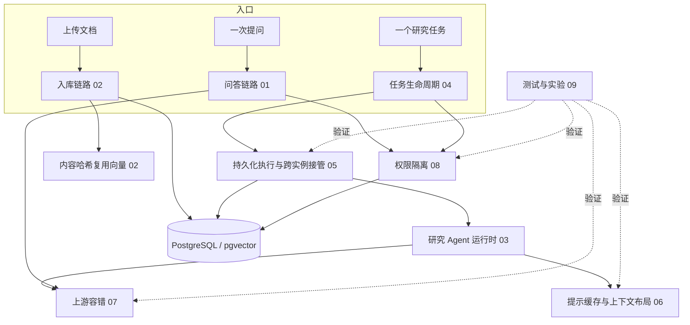

# 00 项目总览与简历口径

这一篇是索引和口径：怎么介绍这个项目、哪些是我做的、十篇笔记怎么对应简历、以及全套笔记用的功能性称呼对应代码里的哪个名字。机制本身都在后面各篇。

## 一、一句话定位与背景

**企业检测资料的知识问答与研究任务平台。** 面向的是检测机构积累的调研表、国标条文、检测报告这类资料：一次提问走检索问答，几秒出一段带来源的回答；一个研究任务则交给 Agent 反复检索、阅读、成文，耗时分钟级，产出一份带引用的报告或一份计划。

**后端围绕五个生产问题展开**：模型调用成本、长任务可靠性、上游容错、资料权限、数据更新。

口径上必须先说清楚的两句：**这是预研原型，没有上线，没有真实流量**；所有数字都来自本地实验，其中接管、上游容错、容量三项是在自己写的模拟上游上跑的，只有成本和答案质量两项用了真实供应商。这两句要主动说，不要等对方问出来——主动说是"知道自己证据的边界"，被问出来就变成"想蒙混"。

## 二、上游自带什么，我写了什么

项目基于开源项目 Ragent 1.1.0 改造。**上游自带**：Spring Boot 骨架与分层、SSE 通道、模型适配层（多供应商、流式）、基础的文档摄取与问答链路（解析、分块、向量化、改写、多通道检索与融合、重排、提示词组装）、排队限流、会话记忆、链路追踪。

**我写的**分两部分：

- **研究任务模块整体**：任务表与状态机、事件按序号持久化与 SSE 续传、Agent 运行时（工具循环、先读后引、预算、子 Agent 委派）、产物生成与引用校验。第 03、04 篇讲的东西基本全是这块。
- **七项可靠性与成本改造（W1—W7）**：见下表。

在上游原有的问答链路上我只动了四处（召回前的权限求交、请求级上下文额度与公平回填、候选池成本兜底、停止接口的归属校验），另外删掉了上游的意图树、关键词通道、图谱通道和 MCP 工具——第 01 篇里逐处标注了哪些是上游的、哪些是我加的。

被问到"哪部分是开源项目自带的"，就按这一节回答，不要含糊。

## 三、模块地图

七项改造与篇目的对应：

| 编号 | 做了什么 | 在哪篇 |
| --- | --- | --- |
| W1 | 稳定前缀 + 提醒后置 + 阈值压缩 + 显式缓存断点 | 06 |
| W2 | 心跳租约、`SKIP LOCKED` 领取、epoch 写保护、事件重建续跑、优雅停机 | 05 |
| W3 | 分层截止时间、抖动退避的有限重试、失败与无命中分离、熔断回退 | 07 |
| W4 | 可见性三档与授权、唯一判定入口、召回前过滤、越权矩阵 | 08 |
| W5 | 按（模型、维度、内容哈希）复用向量 | 02 |
| W6 | W1 的答案质量护栏（400 道未见过的题） | 06（结论）、09（方法） |
| W7 | 多实例排空积压的容量基准 | 05（结论）、09（方法） |

## 四、简历三条各对应哪几篇

| 简历条目 | 主要篇目 | 会被追问而落在别处的部分 |
| --- | --- | --- |
| **长任务可靠性**（数据库队列、心跳租约、epoch 写保护、事件回放、故障注入验证） | **05** | 状态机与取消传播在 04；续跑重建的是什么上下文在 03；实验怎么搭在 09 |
| **模型调用成本**（调用台账发现缓存失效、稳定前缀与显式断点、命中率与输入成本） | **06** | 多轮对话为什么会越来越长在 03；质量护栏的实验设计在 09 |
| **上游容错**（分层超时、抖动重试、失败与无命中分离、成功率提升） | **07** | 检索本身在 01；模拟上游怎么造故障在 09 |

简历里出现的每个名词都能在正文里找到成段的解释：心跳租约、epoch 写保护、事件回放（05）；调用台账、缓存前缀、显式缓存断点（06）；分层超时、抖动重试、失败与无命中分离（07）；模拟上游（09）。

## 五、和秒杀项目的呼应点

两个项目问的其实是同一批问题，面试时可以互相印证，说法要一致：

- **锁与租约**：秒杀里用分布式锁保证同一时刻只有一个人改库存，这里用"短租约 + 心跳 + epoch 写保护"保证同一时刻只有一个执行者能写任务。区别值得主动讲：分布式锁靠持有者主动释放，持有者猝死要等过期；这里除了过期还加了 fencing token，所以**旧持有者醒过来也写不进去**，这是锁本身给不了的。
- **限流与排队**：秒杀是入口削峰，这里是问答链路的公平排队（默认 10 路并发、最长等 15 秒）和研究任务的槽位（每实例 2 个）。共同点是"拒绝要比拖垮好"，区别是研究任务队列满了不拒绝、留在数据库里等下一轮轮询。
- **幂等**：秒杀靠唯一索引挡重复下单，这里研究任务创建也是唯一索引加 `ON CONFLICT DO NOTHING` 再回读，而事件序号用行锁里的 `UPDATE ... RETURNING` 分配。三种幂等做法（唯一索引、条件更新、token）可以一起讲。
- **数据库能不能当队列**：秒杀里通常答"不能，要用 MQ 削峰"，这里答"能，因为量级是每分钟几十条而不是每秒几万条，而且任务状态本来就在库里，再加 MQ 就有两处状态要对齐"。两个答案不矛盾，差别在量级和状态归属——这个对比本身就是一个好的回答。

## 六、术语对照

全套笔记为了少用私有名字，一律用功能性称呼。这张表是唯一集中列出代码中名字的地方，只在需要回代码里找时用。

| 笔记里的称呼 | 代码里的名字 |
| --- | --- |
| 任务表 / 事件表 / 证据表 | `t_research_run` / `t_research_event` / `t_research_evidence` |
| 领取语句 | `ResearchRunStore` 里带 `FOR UPDATE SKIP LOCKED` 的批量领取 |
| 执行者（执行实例） | `ResearchRunService`，执行者身份是实例 ID |
| 写保护四条件 | `ResearchRunStore` 里每次写入前的条件更新（状态、epoch、租约令牌、租约未过期） |
| 续跑重建 | `ResearchHistory` |
| 会话对象 / 预算 / 取消控制 | `ResearchSession` / `ResearchBudget` / `ResearchControl` |
| 子 Agent 协调 | `ResearchWorkerCoordinator` |
| 产物生成与校验 | `ResearchArtifactGenerator`、`PlanDraftValidator` |
| 模型调用包装器 | `BoundedResearchModel` |
| 调用台账 | `ResearchBudget` 里的调用列表，随任务快照落库 |
| 缓存标记与传输改写 | `PromptCacheFormatter` / `PromptCacheTransport` |
| 请求操作包装（分层截止时间、重试、台账） | `infra-ai` 的 `RequestOperation` |
| 候选模型熔断 | `ModelHealthStore`、`ModelRoutingExecutor` |
| 权限判定入口 | `KnowledgeAccessService` |
| 检索范围解析 | `RetrievalScopeResolver`、`KbCollectionProvider` |
| 知识库表 / 授权表 | `t_knowledge_base` / `t_knowledge_base_grant` |
| 嵌入缓存 | `t_embedding_cache`、`PgEmbeddingCache` |
| 向量化入口 | `ChunkEmbeddingService` |
| 落库扇出（先删后插） | `ChunkIndexWriter` |
| 模拟上游 | `eval/agentic-research/stub_upstream.py` |
| 接管实验 / 上游实验 / 容量实验 | `x2_takeover.py` / `x3_upstream.py` / `x6_capacity.py` |
| 缓存报表 / 质量归因 / 抽样 | `cache_report.py` / `quality_diff.py` / `w6_case_ids.py` |
| 越权矩阵 | `KnowledgeAccessMatrixPostgresIT` |

## 边界与不足

- **没上线、没有真实流量**，负载全部由固定题集和脚本化任务构造，所有结论都只在这个前提下成立。
- **机制类数字基于模拟上游**（接管、上游容错、容量三项）。模拟上游的延迟是均匀分布、故障是独立同分布，真实供应商的慢和限流是成串的、有配额语义的。
- **成本与质量的实验只跑了一两次**，因为要真调模型；质量护栏的结论是"未见显著下降"，不是"没有下降"，细节见 06。
- **一个人做的**，没有代码评审、没有灰度、没有线上监控告警，可观测性只到调用台账和事件表的程度。
- **改造集中在研究任务这条链路上**，上游自带的问答链路除四处外基本没动，工业资料的解析与检索质量是更早期的工作，与这次的七项不是同一批实验。

## 口述版

这个项目是给检测机构做的资料问答和研究平台，基于一个开源的 RAG 项目改的。上面有两种用法：一种是直接提问，几秒钟出一段带来源的回答；另一种是提一个研究任务，后台的 Agent 反复检索、阅读、写报告，一次要跑几分钟、十几次模型调用。我负责的是研究任务这个模块，以及围绕它的可靠性和成本优化。

开源项目本身给的是 Spring Boot 骨架、SSE、模型适配和一条基础的问答链路。研究任务模块是我从头写的——任务表和状态机、事件持久化和断线续传、Agent 的工具循环和子 Agent 委派、报告生成和引用校验。在这之上我解决了五个问题：长任务在发版和宕机时会整批丢失，我用 PostgreSQL 当队列加心跳租约和 epoch 写保护做跨实例接管和断点续跑；多轮调用的提示缓存几乎全部失效，我从调用台账定位到是每轮改写首条系统消息破坏了缓存前缀，改成稳定前缀加显式断点之后命中率恢复到八成左右；第三方模型和 Embedding 接口超时限流时任务会大面积失败，我做了分层超时、带抖动的有限重试，还把调用失败和检索无命中分开；另外还有企业资料的权限隔离和按内容哈希复用向量的增量更新。

需要先说清楚的是，这是一个预研原型，没有上线，没有真实流量。所有数字都是本地实验做出来的，其中接管、容错、容量这三项用的是我自己写的模拟上游，测的是我这套机制而不是供应商的真实行为；只有成本和答案质量这两项是真调了模型。我可以详细讲其中任何一项的实现和验证方式。
